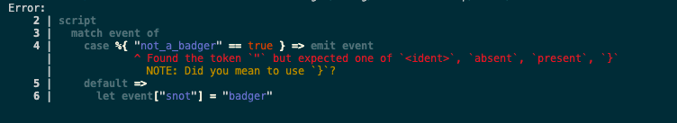

<!-- .slide: data-background="#333333" -->

## Operations and Development - 1

- Installation & Deployment
- Configuration
- Pipeline Development

---

## Installation

__Docker:__

```
docker run --rm -t tremorproject/tremor:latest
```

---

## Installation

__From source:__

1. [Install Requirements](https://docs.tremor.rs/development/quick-start/#without-docker)
2. Get a  **huge** cup of coffee!
3. Compile the `tremor` binary:

```sh
cargo build --release --all
```

>>>

## Starting Tremor

One binary to rule them all:

* [tremor](https://docs.tremor.rs/operations/cli/)

---

## Starting Tremor

Getting help

```sh
$ tremor --help
```

---

## Starting Tremor

Start a naked tremor instance:

```sh
$ tremor server run
```

---

## Starting Tremor

Start tremor and deploy provided static artefacts:

```sh
$ tremor server run -f pipeline.trickle -f artefacts.yaml
```

>>>

## Repositories and Artefacts

- Artefacts are configurations that are available and addressable within tremor  <!-- .element: class="fragment" data-fragment-index="1" -->
  - [Sources](https://docs.tremor.rs/artefacts/onramps/)
  - [Sinks](https://docs.tremor.rs/artefacts/offramps/)
  - [Pipelines](https://docs.tremor.rs/tremor-query/)
  - [Bindings](https://docs.tremor.rs/operations/configuration-walkthrough/#write-a-binding-specification) (connections of the three former artefacts)
- Artefacts will be instantiated and connected to form event flows <!-- .element: class="fragment" data-fragment-index="2" -->

---

## Repositories and Artefacts

- Artefacts are published into the repository:

```yaml
# onramp.yaml
id: my-onramp
type: file
preprocessors:
  - remove-empty
config:
  source: "/var/log/mail.log"
```

<!-- .element: class="fragment" -->

```sh
tremor server run -f onramp.yaml
```

<!-- .element: class="fragment" -->

---

## Repositories and Artefacts

- Artefacts are available for instantiation
- Fully deploying a connected pipeline is a 2-step process

---

## Bindings

- Onramps, pipelines, offramps are connected via binding artefacts
- can be templates, interpolated:

```yaml
id: my-binding
links:
  '/onramp/onramp-artefact-id/{instance}/out':
    - '/pipeline/my-pipeline/{instance}/in'
  '/pipeline/my-pipeline/{instance}/out':
    - '/offramp/offramp-artefact-id/{instance}/in'
```

>>>

## Registry and Instances

- Connected pipelines are started by instantiating a binding
- filling in the missing interpolations

```yaml
mapping:
  instance_01:
    instance: "01"
  instance_02:
    instance: "02"
```

<!-- .element: class="fragment" -->

---

## Registry and Instances

- for each referenced artefact an instance is created (if necessary) <!-- .element: class="fragment" -->
- instances live in the registry <!-- .element: class="fragment" -->
- bindings represent connected event flows <!-- .element: class="fragment" -->
- runtime starts artefacts and events can flow <!-- .element: class="fragment" -->

>>>

## Changing Configuration at Runtime

- via [REST API](https://docs.tremor.rs/api/)
- publish, unpublish artefacts, instantiate bindings

<div style="font-size: 0.8em">

```json
$ curl -X POST \
    -H "Content-Type: application/yaml" \
    --data-binary @metronome-onramp.yaml \
    http://localhost:9898/onramp
{
  "id":"ws",
  "type":"rest",
  "description":"",
  "linked":false,
  "codec":"string",
  "config":{
    "host":"127.0.0.1",
    "port":8080
  }
}
```

</div>

<!-- .element: class="fragment" -->


---

### Bindings can only be deleted and redeployed, not changed dynamically

>>>

## Pipeline Development

- [tremor language server](https://github.com/tremor-rs/tremor-language-server)
---

### Tremor Language Server

1. Install rust via rustup:

```sh
$ curl --proto '=https' --tlsv1.2 -sSf https://sh.rustup.rs | sh
```

2. Setup cargo and install `tremor-language-server`:

```sh
$ export PATH="~/.cargo/bin:$PATH"
$ cargo install tremor-language-server
```

### IDE/Editor Integration

- [VS Code extension](https://marketplace.visualstudio.com/items?itemName=tremorproject.tremor-language-features)
- [VIM plugin](https://github.com/tremor-rs/tremor-vim) (There are no other valid editors!)

---

## Look ma, no YAML! (almost)

- Proper language means: <!-- .element: class="fragment" -->
  - powerful parser/interpreter <!-- .element: class="fragment" -->
  - helpful errors beyond syntax <!-- .element: class="fragment" -->
  - more expressive <!-- .element: class="fragment" -->
  - IDE support <!-- .element: class="fragment" -->


---

## Quick Iterative Testing

Example Pipeline

<div style="font-size: 0.8em;">

```trickle
# example.trickle
define script example
script
  match event of
    case %{ "not_a_badger": true } => emit event
    default =>
      let event["snot"] = "badger"
  end;
  event;
end;

create script example;

select event from in into example;
select from example into out;
```

</div>

---

## Quick Iterative Testing

- Catch errors far before production

```sh
tremor run example.trickle
```

 <!-- .element: class="fragment" -->

---

## Quick Iterative Testing

- Test your pipeline against synthetic events

<div style="font-size: 0.7em;">

```sh
$ echo \{\"type\": \"sneaky\", \"not_a_badger\": false\} | tremor run example.trickle
{"not_a_badger":false,"snot":"badger","type":"sneaky"}
```

```json
tremor run example.trickle -i input_events.json -d json
{"cute":0.5,"snotty":true,"filthy":false,"snot":"badger"}
{"snot":"badger"}
{"not_a_badger":true,"type":"sneaky"}
```

<!-- .element: class="fragment" -->

</div>

---

## Quick Iterative Testing

For more see: [Testing Deep Dive](../testing/index.html)

>>>

## Lab Exercise 1

<div style='font-size: 20px'>

In this section, we will gradually build a solution for processing apache logs
with tremor.
</div>


<div style="font-size: 42px; font-weight: bold;" class="fragment">

Time to wake up!

</div>

---

## Goal

Before:

```
127.0.0.1 - - [19/Jun/1998:22:00:05 +0000] "GET /english/images/comp_bg2_hm.gif HTTP/1.0" 200 3785
```

After:

```json
{
  "ip": "127.0.0.1",
  "timestamp": "19/Jun/1998:22:00:05 +0000",
  "method": "GET",
  "path": "/english/images/comp_bg2_hm.gif",
  "proto": "HTTP/1.0",
  "code": 200,
  "cost": 3785
}
```

---

## Task 0: Setup trecker

```sh
# directory where we will keep all the lab content
mkdir tremor && cd tremor

# download trecker
curl https://docs.tremor.rs/course/scripts/trecker -o trecker
chmod u+x trecker

# validate. should give cli usage
# optional: place the script somewhere in your $PATH for wider access
./trecker -h
```

---

## Task 1: Get test data

```sh
# download and decompress
curl -L -o apache_access_logs.xz "https://bit.ly/tremor-apache-logs"
unxz apache_access_logs.xz

# inspect the logs
cat apache_access_logs | less
```

---

## ✋ Task 2: Passthrough pipeline

<div style='font-size: 25px'>

Write a passthrough trickle pipeline **`apache.trickle`** that passes each log line as is.

<hr/>

That is, running the following should give the same output as running `cat apache_access_logs`.

```sh
# we decode the log lines as plain string (default is to treat them as json)
# the `/pwd/` prefix is needed here to pick up these files from the container
./trecker run /pwd/apache.trickle --decoder string --encoder string -i /pwd/apache_access_logs
```

Or if you have the tremor binary:
```sh
cat apache_access_logs |
    tremor run apache.trickle --decoder string --encoder string
```

You can use these commands throughout this lab to iterate on the pipeline code.
</div>

---

## Task 2: Solution

```trickle
select event from in into out;
```

---

## ✋ Task 2.5: Error test

<div style='font-size: 25px'>

Try introducing a typo (eg: `selectt` instead of `select`) and see what happens.

<hr/>

```
./trecker run /pwd/apache.trickle --decoder string --encoder string -i /pwd/apache_access_logs
Error:
    1 | selectt event from in into out;
      | ^^^^^^^ Found the token `selectt` but expected one of `#!config`, `create`, `define`, `mod`, `select`
      |         NOTE Did you mean to use `select`?

```

Yay nice errors! <!-- .element: class="fragment" -->

</div>

---

## ✋ Task 3: Passthrough pipeline v2

<div style='font-size: 25px'>

Introduce a new node called **`process`** in **`apache.trickle`**, based on the <a href="https://docs.tremor.rs/tremor-query/operators/#script">tremor-script operator</a>. The script will also pass in the log line as is, for now.

```
in -> process -> out
```
<hr/>

```sh
# we decode the log lines as plain string (default is to treat them as json)
# the `/pwd/` prefix is needed here to pick up these files from the container
./trecker run /pwd/apache.trickle --decoder string --encoder string -i /pwd/apache_access_logs
```


</div>

---

## Task 3: Solution

```trickle
define script process
script
  event;
end;

create script process;

select event from in into process;
select event from process into out;
# This will additionally print script errors to the
# error port of the pipeline
select event from process/err into err;
```

---

## ✋ Task 4: Parse a log line

<div style='font-size: 25px'>

Using the <a href="https://docs.tremor.rs/tremor-script/extractors/dissect/">dissect extractor</a>, convert the log string into a structured record.

<hr/>

```sh
# get just one log line for testing the parsing logic:
# 127.0.0.1 - - [19/Jun/1998:22:00:05 +0000] "GET /english/images/comp_bg2_hm.gif HTTP/1.0" 200 3785
tail -1 apache_access_logs > test_log_line

# ignore diagnostics from trecker and get the final line only
./trecker run /pwd/apache.trickle --decoder string --encoder string -i /pwd/test_log_line | tail -n1 | jq
```

Output should be:

```json
{
  "ip": "127.0.0.1",
  "timestamp": "19/Jun/1998:22:00:05 +0000",
  "method": "GET",
  "path": "/english/images/comp_bg2_hm.gif",
  "proto": "HTTP/1.0",
  "code": 200,
  "cost": 3785
}
```
</div>

---

## Task 4: Solution

<div style='font-size: 0.75em;'>

```trickle
define script process
script
  match {"log": event} of
    case dissect_result = %{ log ~= dissect|%{ip} %{} %{} [%{timestamp}] "%{method} %{path} %{proto}" %{code:int} %{cost:int}| } =>
      dissect_result.log
    default =>
      emit {"error": "Malformed log line", "event": event} => "err"
  end;
end;

create script process;

select event from in into process;
select event from process into out;

select event from process/err into err;
```

</div>

---

## Task 5: Parse all log lines

<div style='font-size: 25px'>
See if there's any error events when running the above script for all the logs.

```
./trecker run /pwd/apache.trickle --decoder string --encoder string -i /pwd/apache_access_logs
```

For logs with malformed errors, we can try to add a dissect pattern that would match it (leave as an exercise for later).

Also try switching the encoder to something like `yaml`.
</div>

---

## Extra-credit

* Filter out logs with status code < 400 (i.e. only pass error logs)
* Throttle logs such that output is just 10 logs per second
* Each 10 seconds output request duration percentiles by HTTP status code

>>>

## Lab Exercise 2

<div style='font-size: 20px'>

In this section, we'll take the processing from the last
lab and create a deployment from it.

</div>

<div style="font-size: 42px; font-weight: bold;" class="fragment">Time to stay awake!</div>

---

## Goal

Create a deployment for tremor that listens on tcp port `4242` and reads a log per line
then process it via the pipeline we created in the last section.

---


## ✋ Task 1: Create a source

<div style='font-size: 25px'>

Create a **`source.yaml`** with a <a href="https://docs.tremor.rs/artefacts/onramps/#tcp">`tcp` source</a> to listen on `0.0.0.0:4242` for incoming events.

Use a <a href="https://docs.tremor.rs/artefacts/preprocessors/#lines">`lines` preprocessor</a> to split the incoming data by line and a <a href="https://docs.tremor.rs/artefacts/codecs/#string">`string` codec</a>.

</div>

---

## Task 1: Solution

```yaml
# The onramp and offramp sections of configuration specify external sources
# to an instance of tremor server.
#
onramp:
  - id: tcp-input # A unique id for binding/mapping
    type: tcp # The unique type descriptor for the onramp ( websocket server here)
    codec: string # The underlying data format expected for application payload data
    preprocessors: # Split incoming data by line
      - lines
    config:
      port: 4242 # The TCP port to listen on
      host: "0.0.0.0" # The IP address to bind on ( all interfaces in this case )
```

---

## ✋ Task 2: Create a sink

<div style='font-size: 25px'>

Create a **`sink.yaml`** with a <a href="https://docs.tremor.rs/artefacts/offramps/#stdout">stdout sink</a>.

Use the <a href="https://docs.tremor.rs/artefacts/codecs/#json">`json` codec</a> and `>>` as a prefix.

<hr/>

**Reminder**: The offramp sections of configuration specify external sinks to an instance of tremor server.

</div>

---

## Task 2: Solution

```yaml
offramp:
  - id: stdout-output # The unique id for binding/mapping
    type: stdout # The unique type descriptor for the offramp ( stdout here )
    codec: json # The underlying data format expected for application payload data
    config:
      prefix: ">> " # A prefix for data emitted on standard output by this offramp

```

---
## ✋ Task 3: Create a binding

<div style='font-size: 25px'>

Create a **`binding.yaml`**  with a binding `lab02` that links the sink and source to the pipeline.

Note since we called the pipeline file `apache.trickle` the pipeline will be named `apache`.

<hr/>

**Reminder**:
A binding associates sinks and sources with pipeline inputs and outputs
through their unique identifiers to create a deployment graph template. These
typically use variables that are incarnated using runtime mappings so that
bindings can be reused where appropriate.

</div>

---

## Task 3: Solution

```yaml
binding:
  - id: lab02                                    # The unique name of this binding template
    links:
      '/onramp/tcp-input/{instance}/out':        # Connect the source to the pipeline
       - '/pipeline/apache/{instance}/in'
      '/pipeline/apache/{instance}/out':         # Connect the pipeline to the sink
       - '/offramp/stdout-output/{instance}/in'
      '/pipeline/apache/{instance}/err':         # Direct pipeline errors to stdout as well
       - '/offramp/stdout-output/{instance}/in'
```

---

## ✋ Task 4: Create the mapping

<div style='font-size: 25px'>

Create a **`mapping.yaml`** to initialize the binding.

You can use the instance `01` or any other name

<hr/>

**Reminder**: Mappings instanciate bindings and provide the variables / instances for them
to resolve to full names.

</div>

---

## Task 4: Solution

```yaml
mapping:
  /binding/lab02/01:
    instance: "01"
```

---

## Final steps

<div style='font-size: 25px'>

Can be tested with the following commands. Note that once trecker is started you need to
use `docker stop` to stop it again. `CTRL+C` has no effect.

```sh
./trecker server run -f /pwd/apache.trickle /pwd/source.yaml /pwd/sink.yaml /pwd/binding.yaml /pwd/mapping.yaml

# send logs to the tremor tcp receiver
cat apache_access_logs | nc 127.0.0.1 4242
```

</div>

>>>

### You made it through the lab!!!


>>>
### End of `operations` guide
<!-- .slide: data-background="#33FF77" -->

This is the end of the operations guide

Note: This will only appear in speaker notes window
