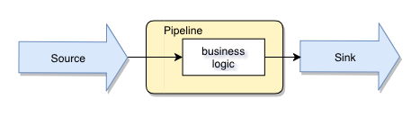

<!-- .slide: data-background="#333333" -->

## What is Tremor?

Tremor is a generic event-based system designed for data distribution, routing
and processing in 24x7x365 high frequency at scale environments.

---

## History

- Running in continuous production at Wayfair since October 2018. <!-- .element: class="fragment" -->
- Born out of a need for better traffic shaping, load shedding and backpressure detection when shipping logs/metrics during peak eCommerce trading. <!-- .element: class="fragment" -->


---

## History

- Evolved to tackle other processing needs (collection, transformation and aggregation) for logs and metrics. <!-- .element: class="fragment" -->
- Addressed gaps not fulfilled by exisiting tools in use (eg: logstash, telegraf, kapacitor). <!-- .element: class="fragment" -->
- 6 (and counting) distinct usecases at Wayfair now, with applications also outside of the observability domain (eg: search data distribution). <!-- .element: class="fragment" -->

---

## History

- [Open sourced](https://github.com/tremor-rs/) on Feb 25, 2020.
- External adoption and interest.
- [CNCF sandbox project](https://www.cncf.io/sandbox-projects/) since September 2020!


---

## Scale

Tremor excels in large-scale environments with high frequency data-processing
requirements.

_Some numbers from Wayfair:_

- 10 terabytes of data per day, or 10 billion events per minute
- 10x footprint reduction in bare metal infrastructure (in terms of no of hosts/cpu/memory).

---

## UX

Tremor has good UX. It doesnt <b>SUX</b> in many ways:

- Define core processing logic in a proper language with editor support (no YAML!).
- Informative errors -- doesn't barf stacktraces.
- Won't panic in production. Built in a [safe programming language](https://www.rust-lang.org/) (mostly).
- Out-of-the-box support for multiple data sources.
- Reusable building blocks that can be composed flexibly for need at hand.

---

## Productivity

Tremor replaces an eclectic range of in-house, commercial, off-the-shelf and
open-source tools with a single, easier-to-operate solution designed for very
high usability in at-scale production environments

---

## Reliability

Tremor is in continuous production for 2 years, with expanding use cases
that span logging, metrics, data technologies, kubernetes and search tech domains
with a small core development team. Tremor has never had a serious incident in
production.

>>>


### Architecture Overview

A high-level overview of tremor-based systems architecture:

---

### Tremor Nodes


---
### Core concepts


- __Sources__. Ingest data from the outside world and deserialize to events (onramps).
- __Sinks__. Send serialized events to the outside world (offramps).
- __Pipelines__. Business logic compiles to an event flow DAG.

>>>

### Sources

- Tap on external data sources:
  - network (tcp, udp, http, websocket) <!-- .element: class="fragment" -->
  - file <!-- .element: class="fragment" -->
  - system clock (metronome, crononome) <!-- .element: class="fragment" -->
  - database (polling for changes) <!-- .element: class="fragment" -->
  - ... <!-- .element: class="fragment" -->

---
### Sources

- Define mapping between protocol data units and events (preprocessors, codec). <!-- .element: class="fragment" -->
- Implemented in the Rust programming language. <!-- .element: class="fragment" -->
- Configured in YAML. <!-- .element: class="fragment" -->

---

<div style="font-size: 0.8em;">

```yaml
- id: kafka-in
  type: kafka
  codec: json
  config:
    brokers:
      - kafka:9092
    topics:
      - tremor
    group_id: demo
    rdkafka_options:
      message.max.bytes: 1000
```

</div>

<div style='font-size: 20px'>Kafka source</div>

---

<div style="font-size: 0.8em;">

```yaml
- id: postgres-input
  type: postgres          # Use postgres/timescale connector
  codec: json             # Specify data format as json
  config:
    host: postgres        # Domain hostname
    port: 5432            # TCP port
    user: postgres        # Username
    password: example     # Password
    dbname: products      # Database
    interval_ms: 10000    # Polling interval ( 10 seconds )
    query: "SELECT * FROM transactions WHERE created_at >= $1 AND created_at < $2;"
    consume_from: "2019-12-01 00:00:00.000000 +00:00"
    cache:
      path: "/etc/tremor/cache.json"      # Track continuation/resume point
      size: 4096                          # Retention ( number of documents )
```

</div>

<div style='font-size: 20px'>TimescaleDB source (periodic polling)</div>

>>>

### Sinks

- Send events to external system:
  - network (tcp, udp, http, websocket) <!-- .element: class="fragment" -->
  - database (postgresql) <!-- .element: class="fragment" -->
  - std streams <!-- .element: class="fragment" -->
  - file <!-- .element: class="fragment" -->


---

### Sinks

- Defines mapping for outgoing events and protocol data units (codec, postprocessors). <!-- .element: class="fragment" -->
- Implemented in the rust programming language. <!-- .element: class="fragment" -->
- Configured in YAML. <!-- .element: class="fragment" -->

---

```yaml
- id: elastic-output
  type: elastic
  config:
    nodes:
      - elastic01:9200
      - elastic02:9200
    concurrency: 8
```

<div style='font-size: 20px'>Elastic Sink</div>

---

```yaml
- id: debug
  type: stdout
  codec: json
```


<div style='font-size: 20px'>Development convenience for interactive debugging</div>

>>>

### Pipelines

- Define event flow in user-defined business logic.
- Implemented in [tremor-query](https://docs.tremor.rs/tremor-query/).


```trickle
# simplest passthrough pipeline
select event from in into out;
```

---

### Pipelines

- Filter and transform events.

```trickle
use std::array;
use std::string;
use std::integer;

# transform using select
select {
  "clean_key": string::lowercase(string::trim(event.key)),
  "value": integer::parse(event.str_value)
}
from in
where  # filter using where clause
  array::contains(event.tags, "important")
into out;
```

---
### Pipelines

- Event introspection.
- Rich extractors.

```tremor
define script extract_http_url
script
  # validate a url
  match event.url of
    case https_url ~= re|^https?://.*/$| => https_url
    default => drop "not a https url"
  end;
end;
```

---
### Pipelines

- Grouping and windowing.

```trickle
# emits event every 15 secs
define tumbling window fifteen_secs
with
  interval = datetime::with_seconds(15)
end;

# generates aggregated event per window and group
select {"count": aggr::stats::count() }
from in[fifteen_secs]
group by set(event.partition)
into out
having event.count > 0;
```
---

### Pipelines

- Powerful operators.

```trickle
# distribute events across outputs evenly
# stop traffic for unreachable/erroneous outputs
define qos::roundrobin operator h3_roundrobin
with
  outputs = ["host01", "host02", "host03"]
end;

create operator my_h3_rr from h3_roundrobin;
```
---

### Pipelines

- Express complex logic in functional expression language [tremor-script](https://docs.tremor.rs/tremor-script/).

<div style="font-size: 22px!important">

```trickle
define script extract                                # define the script that parses our apache logs
script
  match {"raw": event} of                            # we user the dissect extractor to parse the apache log
    case r = %{ raw ~= dissect|%{ip} %{} %{} [%{timestamp}] "%{method} %{path} %{proto}" %{code:int} %{cost:int}\\n| }
            => r.raw                                 # this first case is hit if the log includes an execution time (cost) for the request
    case r = %{ raw ~= dissect|%{ip} %{} %{} [%{timestamp}] "%{method} %{path} %{proto}" %{code:int} %{}\\n| }
            => r.raw                                 # the second case is hit if the log does not includes an execution time (cost) for the request
    default => emit => "bad"
  end
end;
```
</div>

---

### Deployment Logic

<div style="font-size: 28px!important">

```yaml
binding:
  - id: app-template
    links:
      '/onramp/postgres-input/{instance}/out':
        - '/pipeline/measure-pg/{instance}/in'
      '/onramp/crononome-input/{instance}/out':
        - '/pipeline/measure-cron/{instance}/in'
      '/pipeline/measure-pg/{instance}/out':
        - '/offramp/timescale/{instance}/in'
        - '/offramp/system::stdout/{instance}/in'
      '/pipeline/measure-cron/{instance}/out':
        - '/offramp/timescale/{instance}/in'
        - '/offramp/system::stdout/{instance}/in'
mapping:
  /binding/app-template/my-instance:
    instance: 'my-instance'
```


```shell
tremor server run
  -f postgres.trickle cron.trickle  \ # logic
    postgres.yaml cron.yaml         \ # sources
    timescale.yaml                  \ # sinks
    instance.yaml                   \ # instances
```

</div>
---

### Deployment diagram


>>>

### Linked Transports

- Typical event-processing flow is one-direction only.
- But most network traffic is request-response.



---

### Linked Transports


- Enables bridging, load balancing and routing RPC protocols.
- Allows request and response flows to be implemented in event logic.
- Allows service control and data abstractions to be adapted to event logic.

---

```yaml
onramp:
  - id: http
    type: rest
    linked: true    # enable linked transport
    codec: string
    config:
      host: 0.0.0.0
      port: 8139
```

---

```yaml
binding:
  - id: main
    links:
      "/onramp/http/{instance}/out":
        ["/pipeline/request_processing/{instance}/in"]

      # process incoming requests and send back the response
      "/pipeline/request_processing/{instance}/out":
        ["/onramp/http/{instance}/in"]
```

More details in our [docs](https://docs.tremor.rs/operations/linked-transports/) and [workshops](https://docs.tremor.rs/workshop/examples/30_servers_lt_http/).

>>>

### API

- The tremor API is used for monitoring, deployment and administration.
- Publish, find and bind sources, sinks, pipelines.
- Sources and Sinks are automatically removed upon quiescence.
- Connect sources to pipelines.
- Connect pipelines to sinks.

---

- [API documentation](https://docs.tremor.rs/api/)
- [API cli](https://docs.tremor.rs/operations/cli/#api)


<div style='font-size: 20px'>You can proxy the API using linked transports</div>

>>>

### Solutions

<div style='font-size: 20px'>
In this section, we look at some examples of existing production
solutions based on tremor.
</div>

<br/>

---

### Wayfair Platform Logging Service


<div style='font-size: 20px'>A simplified high-level view of logging systems architecture at Wayfair.</div>


---

### Possible Target Logging Architecture


<div style='font-size: 20px'>A simplified high-level view of one potential future logging systems architecture at Wayfair. Moving the transformation tier logic upstream to the source tiers allows greater flexibility, reduced traffic volumetric, and reduces deployment footprint and associated costs. Tremor as a sidecar is already in production in Kubernetes use cases.</div>

---

### Aggregation and Metrics


<div style='font-size: 20px'>Source tier collects metrics and partitions measures into partitions. Partitions are streamed to the aggregation tier with partition affinity. Aggregation tier summarises and forwards to distribution tier for downstream consumers.</div>

---

### Static Partitioning

```trickle
define script distribute
with
  hosts = ["g1", "g2", "g3"]
script
  use tremor::chash;
  let g = event.tags["__TREMOR_GROUP__"];
  let event.tags = patch event.tags of
    erase "__TREMOR_GROUP__"
  end;
  match args.hosts[chash::jump(g, array::len(args.hosts))] of
    case "g1" => emit => "g1"
    case "g2" => emit => "g2"
    case "g3" => emit => "g3"
    default => emit => "err"
  end
end;

create script distribute;

select
  patch event of
    update "fields" => { "#{group[2]}": event.fields[group[2]] },
    merge "tags" => { "__TREMOR_GROUP__": group[3] }
  end
from in
group by set(event.measurement, event.tags, each(record::keys(event.fields)))
into distribute;

select event from distribute/error into err;
select event from distribute/g1 into out/g1;
select event from distribute/g2 into out/g2;
select event from distribute/g3 into out/g3;
```

---

### Aggregator

```trickle
define tumbling window `10secs`
with
   interval = datetime::with_seconds(10),
end;
define tumbling window `1min`
with
   interval = datetime::with_minutes(1),
end;
define tumbling window `10min`
with
   interval = datetime::with_minutes(10),
end;
define tumbling window `1h`
with
   interval = datetime::with_hours(1),
end;

define generic::batch operator batch
with
  count = 8000,
  timeout = 10000
end;
create operator batch;

select {
    "measurement": event.measurement,
    "tags": patch event.tags of insert "window" => window end,
    "stats": aggr::stats::hdr(event.fields[group[2]], [ "0.5", "0.9", "0.99", "0.999" ]),
    "class": group[2],
    "timestamp": aggr::win::first(event.timestamp), # snot
}
from in[`10secs`, `1min`, `10min`, `1h`]
where event.measurement == "udp_lb_test"
   or event.measurement == "kafka-proxy.endpoints"
   or event.measurement == "burrow_group"
   or event.measurement == "burrow_partition"
   or event.measurement == "burrow_topic"
group by set(event.measurement, event.tags, each(record::keys(event.fields)))
into normalize;

create stream normalize;

select {
  "measurement":  event.measurement,
  "tags":  event.tags,
  "timestamp": event.timestamp, #asdf
  "fields":  {
    "count_#{event.class}":  event.stats.count, # "
    "min_#{event.class}":  event.stats.min,
    "max_#{event.class}":  event.stats.max,
    "mean_#{event.class}":  event.stats.mean,
    "stdev_#{event.class}":  event.stats.stdev,
    "var_#{event.class}":  event.stats.var,
    "p50_#{event.class}":  event.stats.percentiles["0.5"],
    "p90_#{event.class}":  event.stats.percentiles["0.9"],
    "p99_#{event.class}":  event.stats.percentiles["0.99"],
    "p99.9_#{event.class}":  event.stats.percentiles["0.999"]
  }
}
from normalize
into batch;

select event from batch into out;

```

---

### Alerting via Alerta Integration

```trickle
# A 2019 berlin hackathon entry by Ernad Halilovic ( cyclopes )

# normalize
let severity = match event of
  case %{ status == 0 } => "ok"
  case %{ status == 1 } => "warning"
  case %{ status == 2 } => "critical"
  default => "ok"
end;

# Alert to be sent to alerta ( uses http/rest sink )
{
  "attributes": {
    "region": "bo1"
  },
  "correlate": [ "ReplicationError", "ReplicationOK" ],
    "environment": "Production",
    "event": "ReplicationError",
    "group": "Infra",
    "origin": "tremor",
    "resource": "github.infra.network",
    "service": [ "github" ],
    "severity": severity,
    "tags": [ "releng" ],
    "text": "Github replication is problematic.",
    "type": "tremorAlert",
    "value": ""
}
```
---

### AI - Twitter Sentiment Analysis

```trickle
# A 2020 berlin hackaton entry by Christian Rehm et al

define bert::summarization operator s # Bert NLP operator
with
  file = "bla"
end;

define script process
script
  use std::string;
  {
      "summary": $summary,
      "text": string::replace(event, "\n", " ")
  }
end;

create operator s;
create script process;

select event from in into s;
select event from s into process;
select event from process into out;%
```

---

### A distributed configuration micro-service

- [Configurator](https://docs.tremor.rs/workshop/examples/37_configurator/)
- [Quota Service](https://docs.tremor.rs/workshop/examples/36_quota_service/)

<div style='font-size: 20px'>From `v0.9`, tremor can now be used to quickly build and deploy solutions requiring request/response style semantics.</div>

>>>

### New in v0.9 ( `Experimental` )

- [Circuit breakers and guaranteed delivery](https://docs.tremor.rs/operations/gdcb/). Finer grained QoS.
- [Linked Transports](https://docs.tremor.rs/operations/linked-transports/). Enable event-sourced micro-services.
- [Task-based concurrency](https://www.tremor.rs/blog/2020-08-06-to-async-or-not-to-async/). Deploy 1000s of pipelines in 1 tremor node.

>>>


### Future plans

- Clustering based on Raft, enabling resilience for pipelines as well as denser deployments.
- Improve deployment configuration (no YAML anywhere).
- Sliding window mechanism for aggregations.

>>>

### Further reading/help

- [WWW](https://www.tremor.rs)
- [Docs](https://docs.tremor.rs)
- [Rfcs](https://rfcs.tremor.rs)
- [CNCF Landscape](https://landscape.cncf.io/selected=tremor)
- [Github](https://github.com/tremor-rs/tremor-runtime)
- [Twitter](https://twitter.com/tremordebs)
- [Announcements](https://cloud-native.slack.com/messages/tremor)
- [Community Chat](https://bit.ly/tremor-discord)

>>>

### End of `overview` guide
<!-- .slide: data-background="#33FF77" -->

This is the end of the overview.

Note: This will only appear in speaker notes window.
