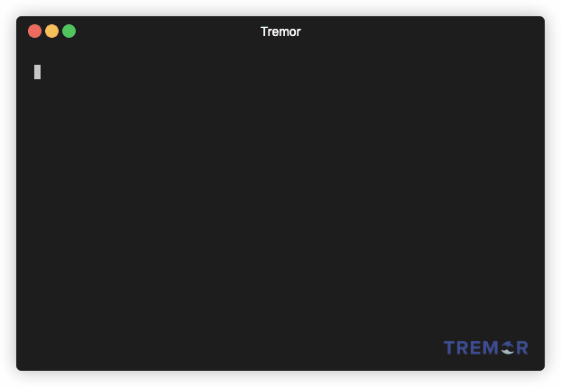

## Unit Testing
<!-- .slide: data-background="#FF7733" -->

Writing unit style tests with `tremor-script`

>>>

### Create a test directory structure for our tests

```shell
$ mkdir tests
$ mkdir tests/unit
$ echo '[ "unit", "inline" ]' > tests/unit/tags.json
$ echo '[ "all" ]' > tests/tags.json
cat <<DATA
{
    "kind": "Unit",
    "includes": "all.tremor"
}
DATA > tests/unit/meta.json
```

<div style='font-size: 20px'>
We can create tags files in any directory called `tags.json` that
are a list of strings that we can use to include or exclude tests
from the test search path.  The `meta.json` file instructs tremor
that the directory structure is for a unit style test.
</div>

---

#### Verify:  `trecker test /pwd/tests`



```shell
$ tremor test unit tests
```

>>>

### Add a test script

```tremor
# File: tests/unit/all.tremor
use std::test;

fn hello(world) with
  "#{world}"
end

test::suite({
  "name": "Our first tremor unit test suite",
  "suite": {
    "name": "A few small steps for tremor kind",
    "tags": [ "hello", "world", "snot", "badger" ],
    "tests": [
      test::test({
        "name": "Test our hello fn",
        "test": test::assert("badger", hello("badger")),
      }),
    ],
  }
});

hello("snot");
```

<div style='font-size: 20px' data-fragment-index=1>
For comprehends array-like structures allowing iteration over each item
</div>

---

#### Verify:  `the test should pass`


```shell
$ TREMOR_PATH=/path/to/tremor-script/lib tremor test unit tests
```

>>>

### Filter specific tests by tag

```shell [1-2|3-4|5-6|7-8]
# Filter out all tests except those tagged with `tag-of-interest`
TREMOR_PATH=/opt/local/tremor/lib trecker test unit /pwd/tests -i tag-of-interest
# Filter in all tests except those tagged with `tag-of-exclusion`
TREMOR_PATH=/opt/local/tremor/lib trecker test unit /pwd/tests -e tag-of-exclusion
# Only test the intersection of tag-of-interest minus tag-of-exclusion
TREMOR_PATH=/opt/local/tremor/lib trecker test unit /pwd/tests -i tag-of-interest -e tag-of-exclusion
# You can use multiple include or exclude tags - each set will be unioned
TREMOR_PATH=/opt/local/tremor/lib trecker test unit /pwd/tests -i tag-of-interest snot -e tag-of-exclusion badger
```

---

### Filter specific tests by tag ( tremor )

```shell [ 1-2|3-4|5-6|7-8]
# Filter out all tests except those tagged with `tag-of-interest`
TREMOR_PATH=/path/to/tremor/lib tremor test unit tests -i tag-of-interest
# Filter in all tests except those tagged with `tag-of-exclusion`
TREMOR_PATH=/path/to/tremor/lib tremor test unit tests -e tag-of-exclusion
# Only test the intersection of tag-of-interest minus tag-of-exclusion
TREMOR_PATH=/path/to/tremor/lib tremor test unit tests -i tag-of-interest -e tag-of-exclusion
# You can use multiple include or exclude tags - each set will be unioned
TREMOR_PATH=/path/to/tremor/lib tremor test unit tests -i tag-of-interest snot -e tag-of-exclusion badger
```

>>>

### Modularize source

Move our function into a new library
```shell
$ mkdir lib
$ mkdir lib/myproject
$ echo '[ "unit" ]' > tests/modular/tags.json
cat <<DATA
{
    "kind": "Unit",
    "includes": "all.tremor"
}
DATA > tests/modular/meta.json
$ vim lib/myproject/mylib.tremor
```

```tremor
### File: lib/myproject/mylib.tremor

## A simple `tremor-script` function
fn hello(world) with
  "#{world}"
end
```

---

### Test our modular function

```tremor
# File: lib/myproject/hello.tremor
use std::test;
use myproject::mylib;

test::suite({
  "name": "Our first tremor unit test suite",
  "suite": {
    "name": "A few small steps for tremor kind",
    "tags": [ "hello", "world", "snot", "badger" ],
    "tests": [
      test::test({
        "name": "Test our hello fn",
        "test": test::assert("badger", mylib::hello("badger")),
      }),
    ],
  }
});

---

### Modular function test run


>>>

### End of `unit test` guide
<!-- .slide: data-background="#33FF77" -->

This is the end of the unit test getting started guide

Note: This will only appear in speaker notes window


