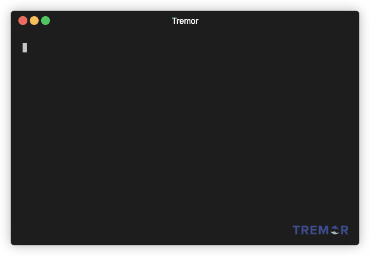
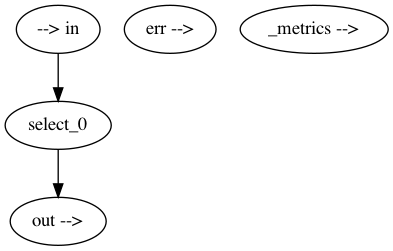

<!-- .slide: data-background="#333333" -->

## The Tremor `tremor` cli

This course is based around the self-named `tremor` command line
interface. This is a single unified command line tool that can
be used throughout the software development and operational lifecycle
to leverage tremor.

```shell
$ tremor # ... arguments
```

>>>

### Setup `docker`

This course assumes an installation of [docker](https://www.docker.com)

```shell [1|2|3|4-5]
$ export TREMOR_IMAGE=tremorproject/tremor:latest # set to `edge` if you feel lucky
$ docker pull $TREMOR_IMAGE
alias trecker=
  'docker run -i -v `pwd`:/pwd $TREMOR_IMAGE $*'
```

Validate the docker based tremor environment:

```shell
$ trecker -h
```

---

### Demo: `verify trecker setup`


<div style='font-size: 20px'>
Hint: Pass `-e "TERM=xterm-256color"` to enable help syntax highlighting
</div>

>>>

### Setup `TREMOR_PATH`

```shell [|1-2|3-4]
# docker packaged standard modules
export TREMOR_PATH=/opt/local/tremor/lib
# docker and user defined mounted modules
export TREMOR_PATH=/opt/local/tremor/lib:/pwd/lib
```

<div style='font-size: 20px'>
Hint: The `TREMOR_PATH` environment variable controls visible modular libraries
available to trecker or tremor. For trecker we mount via `pwd` and expect `lib`
sub-folder in this course
</div>

---

### Local docker

```shell [|1-2|3-4]
# standard modules
export TREMOR_PATH=/path/to/tremor/lib
#  standard and user defined modules
export TREMOR_PATH=/path/to/tremor/lib:/my/project/lib
```

<div style='font-size: 20px'>
Hint: When building and running tremor locally the standard library can be found
in `tremor-script/lib` relative to your git clone. User defined module paths can
be provided to TREMOR_PATH which is a `:` delimited list of paths.
</div>

>>>

### Testing and Benchmarking

```shell
$ tremor test -h
```

See the [testing](../testing/index.html) and [benchmarking](../testing/benchmark.html) guides

>>>

### Shell completions

```shell
$ tremor completions -h
```

Generate shell completions to the console.

---

### Completions: Guess shell

```shell
$ tremor completions guess
```

Guess completion based on current shell

---

### Completions: `bash`

```shell
$ tremor completions bash
```

Generate completions for `bash` shell

---

### Completions: `zsh`

```shell
$ tremor completions zsh
```

Generate completions for `zsh` shell

---

### Completions: `fish`

```shell
$ tremor completions fish
```

Generate completions for `fish` shell

---

### Completions: `elvish`

```shell
$ tremor completions elvish
```

Generate completions for `elvish` shell

---

### Completions: `powershell`

```shell
$ tremor completions powershell 
```

Generate completions for `powershell` shell

>>>

### Generate module documentation

```shell
$ tremor doc -h
```

Generate documentation for `tremor-script` modules

---

### Documentation: Standard library

```shell
$ tremor doc /path/to/tremor/lib docs
```

---

### Documentation: Interactive mode

```shell
$ tremor doc -i /path/to/tremor/lib docs | bat -l md
```

Generate documentation and highlight with `bat` tool in terminal

>>>

### Debug `tremor-script` and `tremor-query`

```shell
$ tremor dbg -h
```

Debug low level compiler metadata for supported DSLs

---

### Debug source

```tremor
# File: hello.tremor
"hello world"
```

```shell [2]
$ tremor dbg src hello.tremor
$ trecker dbg src /pwd/hello.tremor
```

Verify source, showing errors,  and highlight

---

### Debug source: example


```shell
$ trecker dbg src /pwd/hello.tremor
```

---

### Debug lexer

```shell [2]
$ tremor dbg lex hello.tremor
$ trecker dbg lex /pwd/hello.tremor
```

Verify source and show lexemes

---

### Debug lexer: example


```shell
$ trecker dbg lex /pwd/hello.tremor
```

---

### Debug lexical preprocessor

```shell [2]
$ tremor dbg preprocess hello.tremor
$ trecker dbg preprocess /pwd/hello.tremor
```

Verify source and show lexemes

---

### Debug lexical preprocessor


```shell
$ trecker dbg preprocess /pwd/hello.tremor
```

---

### Debug AST

```shell [2]
$ tremor dbg ast hello.tremor
$ trecker dbg ast /pwd/hello.tremor
```

Verify source and show AST

---

### Debug AST: example


```shell
$ trecker dbg ast /pwd/hello.tremor
```

---

### Debug query graph

```trickle
# File: hello.trickle
select event from in into out;
```

```shell [2]
$ tremor dbg dot hello.trickle
$ trecker dbg dot /pwd/hello.trickle

```

Verify query graph and convert to graphviz dot format

---

### Debug query graph - example


```shell
$ trecker dot /pwd/hello.tremor | tee hello.dot | bat -l dot
```

---

### Debug query graph - dot to png


```shell
$ dot -Tpng hello.dot -o hello.png
```

>>>

### Run `tremor-script` and `tremor-query`

```shell
$ tremor run -h
```

Run scripts and queries

---

### Run `tremor-script`

```shell [2]
$ tremor run hello.tremor -i - -d string
$ trecker run /pwd/hello.tremor -i - -d string
```

<div style='font-size: 20px'>
The <code>-i</code> parameter sets the input source to be
the terminal standard input via the <code>-</code> argument.
Alternatively a file can be used as input
</div>

---

### Example script run


```shell
$ trecker run -i - -d string /pwd/hello.tremor
> 1
"hello world"
```

---

### Run `tremor-query`

```shell [2]
$ tremor run hello.trickle -i - -d json
$ trecker run /pwd/hello.trickle -i - -d json
```

<div style='font-size: 20px'>
Use the <code>-d</code> argument to specify a source codec.
</div>

---

### Example query run


```shell
$ trecker run -i - -d string /pwd/hello.tremor
> { "snot": "badger" }
{ "snot": "badger" }
```

---

### Advanced usage

|Option|Description|
|---|---|
|```-i```|Input file or `-` for standard input|
|```-o```|Output file or `-` for standard output|

Redirect standard input or output, or use files

---

### Processors and Codecs


|Option|Description|
|---|---|
|```-d <codec>```|Set the input codec. It defaults to `json`|
|```-e <codec>```|Set the output codec. It defaults to `json`|
|```--preprocessor <name> ```|Set a preprocessor before input codec is invoked|
|```--postrocessor <name>```|Set a postprocessor after output codec is invoked|

>>>

### Run as server

```shell
$ tremor server -h # ...
```

Run the tremor standalone server

---

### Run: Basic usage

```shell [2]
$ tremor server run -f hello.trickle /pwd/hello.yaml
$ trecker server run -f /pwd/hello.trickle /pwd/hello.yaml
```

<div style='font-size: 20px'>
Run the passthrough `hello.trickle` with a metronome source and file-based sink.
The API defaults to running on port 9898.
</div>

---

### Run: Configuration

```yaml
onramp:
  - id: metronome
    type: metronome
    config:
      interval: 1000 # Every second
offramp:
  - id: file
    type: file
    codec: json
    config:
      file: out.log
binding:
  - id: default
    links:
      "/onramp/metronome/{instance}/out": ["/pipeline/hello/{instance}/in"]
      "/pipeline/hello/{instance}/out": ["/offramp/file/{instance}/in"]
mapping:
  /binding/default/01:
    instance: "01"
```

---

### Run: Specify a log file

```shell [2]
$ tremor server run -l logger.yaml -f hello.trickle /pwd/hello.yaml
$ trecker server run -l /pwd/logger.yaml -f /pwd/hello.trickle /pwd/hello.yaml
```

Example log [file](./assets/logger.yaml)

---

### Run: Specify a PID file

```shell [2]
$ tremor server run -p tremor.pid -f hello.trickle /pwd/hello.yaml
$ trecker server run -p /pwd/tremor.pid -f /pwd/hello.trickle /pwd/hello.yaml
```

---

### Run: Disable API

```shell [2]
$ tremor server run -n -f hello.trickle /pwd/hello.yaml
$ trecker server run -n -f /pwd/hello.trickle /pwd/hello.yaml
```

---

### Run: Storage path

```shell [2]
$ tremor server run -d /pwd/data -f hello.trickle /pwd/hello.yaml
$ trecker server run -d data -f /pwd/hello.trickle /pwd/hello.yaml
```

<div style='font-size: 20px'>
The storage path is for runtime generated files, such as persistent
cache files
</div>

---

### Run: Specify module path

Set the `TREMOR_PATH` environment variable to specify one or many
file system roots for `tremor-script` or `tremor-query` modules.

>>>

### API

```shell
$ tremor api -h # ...
```

Use the tremor api

<div style='font-size: 20px'>
As a side-effect this command creates a <code>$HOME/.tremor/config.yaml</code>.


Not covered in this guide.
</div>

>>>
### End of `tremor-cli` guide
<!-- .slide: data-background="#33FF77" -->

This is the end of the tremor cli getting started guide

Note: This will only appear in speaker notes window
