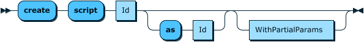
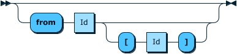

# Tremor-Query

The tremor query language, `tremor-query` or **trickle** is an interpreted statement-oriented language designed for continuous online structured queries with support for filtering, extraction, transformation and streaming of structured data in a stream or event-based processing system.

At its core, `tremor-query` supports the definition of windows operators, stream definitions and operations on those streams such as **select**, **operator** and **script**.

Structured queries in **trickle** consume unstructured data that are in and of themselves at least well-formed ( eg: such as JSON ) and produce synthetic events that are also well-formed and in and of themselves unstructured.

The language does not impose schema based constraints on data flowing through the system, although this may produce runtime errors for badly written queries.

The query language interpreter constructs a directed-acyclic-graph or **DAG** by analysing the dependencies of operators in a user defined query. The input and output streams are then calculated. The DAG model is the same as the pipeline model in previous versions of tremor, but with a rich query language replacing the deprecated tremor yaml format for pipelines.

## Principles

### Safety

The language is explicitly not Turing-complete:

- there are no unstructured `goto` grammar forms
- there are no unbounded `for`, `while` or `do..while` looping constructs
- the language is built on top of [Rust](https://www.rust-lang.org/), inheriting its robustness and safety features, without the development overheads

### Developer friendly

The language adopts a SQL-like syntax for key statement forms and has a path-like syntax for indexing into records and arrays. The statement-oriented query language prefers nested data-structures to tables and columns from traditional ANSI-ISO SQL as most of the data processed through tremor is structured and JSON-like.

The expression language in **trickle** is based on `tremor-script`.

### Stream-oriented / event-based

Tremor-query is designed to process unstructured ( but well-formed ) data events. Event data can be JSON, MsgPack or any other form supported by the tremor event processing system.

### Self-documenting

The SQL-like syntax enables a natural and familiar style whilst allowing the resulting statements to be compiled into a formal DAG for compile-time checks and to ensure correctness.

Leveraging the tremor-query expression syntax allows rich filtering, transformation, patching, merging and object/array comprehensions to be programmed.

The addition of aggregate functions, and windowing allows batches or a slice in time of events to be summarised or processed together to derive useful synthetic events.

Like its sibling language `tremor-script`, `tremor-query` supports the same data-types and is entirely event-driven. It has many parallels for existing tremor users to leverage while learning, yet it is powerful and flexible in its own right.

### Extensibility

The SQL-based nature of `tremor-query` means that complex branching, combining or powerful constructs such as in-memory tables can be added following a familiar SQL-like syntax.

The expression-based expression language derived from `tremor-script` allows computational forms to be extended.

The language core is designed for reuse - currently the expression language is reused in the query language, as are the library of functions available to both. The addition of aggregate functions is currently exclusive to tremor-query as these are only relevant when processing multiple in-flight ( or cached ) events at the same time.

In the future, `tremor-query` may be retargeted as a JIT-compiled language and other domain specific languages may be integrated as the tremor runtime evolves to meet new uses, demands, and stake-holders.

### Performant

Data ingested into tremor-query is vectorized via SIMD-parallel instructions on x86-64 or other Intel processor architectures supporting ssev3/avx extensions. Processing streams of such event-data incurs some allocation overhead at this time, but these event-bound allocations are being written out of the interpreter.

The current meaning of `performant` as documented here means that `tremor-query` is more efficient at processing metrics-like data than the system it replaces ( telegraf / kapacitor / influx ) which do not support rich proactive and reactive back-pressure mechanisms or efficient asynchronous event-based data distribution between system components.

### Productive

The `tremor-query` parsing tool-chain has been designed with ease-of-debugging and ease-of-development in mind. It has builtin support for syntax-highlighting on the console with errors annotating highlighted sections of badly written scripts to simplify fixing such scripts.

The tool-chain inherits most of its core capabilities from the `tremor-script` and pipeline components of the tremor runtime. These components are already in large-scale production use and battle-hardened; this, in turn, minimises any associated risks with introducing a query language, whilst offering a migration path away from the far less expressive and far less easy-to-use yaml-based pipeline configuration which is more error-prone and verbose.

## Language

This section details the major components of the `tremor-query` language.

### Tremor-Script

[Comments](../tremor-script/index.md#comments), [Literals](../tremor-script/index.md#literals), [Paths](../tremor-script/index.md#paths) and Expression forms supported in **trickle** are the
same as in [`tremor-script`](../tremor-script/index.md).

### Queries

A Query consists of one or many statements separated by `;`.

Queries are compiled into a DAG of operator nodes and validated at compile time. At runtime, the resulting executable tremor pipeline is evaluated/interpreted.

##### Grammar

> 

Stmt: <a name="Stmt"></a>
> 

See also [Additional Grammar Rules](#additional-grammar-rules).
### Statements

Statements can be one of:

- [Stream definitions](#stream-definitions)
- [Window definitions](#window-definitions)
- [Custom Operator definitions](#custom-operator-definitions)
- [Embedded `tremor-script` definitions](#embedded-script-definitions)
- Or builtin operations, like the [`select` statement](#select-queries)

#### Stream definitions

Stream definitions in `tremor-query` allow private intermediate streams to be named so that they can be used as the source or sinks in other continuous queries.

##### Grammar

> 

##### Example

```trickle
create stream passthrough;
select event from in into passthrough; # select default public 'in' stream into passthrough
select event from passthrough into out; # select passthrough into default public 'out' stream
```

#### Window definitions

Window definitions in `tremor-query` can be either tumbling or sliding.

A tumbling window is a window configured with a fixed non-overlapping interval of time. The window aggregates events once opened, and continues aggregating until it closes. The window can emit synthetic events upon closing. The window reopens for its next cycle when it closes.

Support for sliding windows has not been implemented yet (it has an [open RFC](https://rfcs.tremor.rs/0004-sliding-window-mechanism/) and it will be picked up for a future release).

#### Tumbling Windows

Tremor supports tumbling windows by number of events or by time.

General configuration Parameters:

* `eviction_period`: duration in nanoseconds without events arriving, after which to evict / remove the current window data for a single group.
* `max_groups`: maximum number of groups to maintain simultaneously in memory. Groups added beyond that number will be ignored. Per default, tremor does not impose any limit on the number of groups kept simultaneously.

Each select statement maintains the groups for the current windows in an in memory data-structure. This contains the group values as well as the aggregate states.
If your grouping values possibly have a very high cardinality it is possible to end up with runaway memory growth, as per default the group data structures won't be evicted,
unless `eviction_period` is set. Old groups will be discarded after `2 x eviction_period` if no event for those groups arrived.
To configure an upper bound on the number of groups that should be maintained simultaneously for a window, set `max_groups`.
This will help avoid unbounded memory growth, especially when using `emit_empty_windows` on time based windows.

##### Windows based on number of events

Size based tumbling windows close when a certain number of aggregated events has been reached.

Configuration Parameters:

- `size`: Number of events until this window closes and emits a downstream event.

The size increment for each event defaults to `1` but can be customized by the embedded script in the window definition.
This script needs to return an unsigned integer denoting the number of events to use for this event.
It is possible to ignore the current event by emitting `0`.

##### Windows based on time

Time based tumbling windows close when a certain duration has elapsed. The source for measuring the duration
is the `ingest` timestamp of the events flowing through by default. The provided embedded script can be used to customize the
source of time measurement. The embedded script must return a number representing a timestamp in nanoseconds.
This way windows using timestamps other than the event ingest time can be built.

Only windows using the event ingest timestamp can be closed when the time in `interval` is elapsed measured by wall-clock time
independent from event flow with a granularity of `100ms`. It is thus possible that empty windows are emitted. Windows using scripts to determine the window elapsed time are considered to deviate from wall clock time and will only close and emit when events flow through them.

Configuration Parameters:

- `interval`: Time interval in nanoseconds after which the window closes.
- `emit_empty_windows` - By default, time based windows will only emit, if events arrived. By configuring `emit_empty_windows` as `true` this window will emit every `interval` for groups it has already seen, regardless if events arrived within `interval` or not.

!!! warning
    If you use a window with `emit_empty_windows` in a `group by` query and the cardinality is likely huge, consider using `max_groups` and `eviction_period` to avoid runaway memory growth such a window will one event per interval and group for which we've seen events before.

#### Windowing Semantics

A select query using one or more windows is generating _new_ synthetic events, aggregated from the events feeded into it. Even if a window only consists of a single event, it needs to be considered a new event. The shape of the new event is determined by the [`select`](#select-queries) _Target Expression_. Those new events will have an empty metadata and the [origin uri](tremor-script/stdlib/tremor/origin.md) is pointing to the windowed [`select`](#select-queries) query.

##### Grammar
> 


See also [Additional Grammar Rules](#additional-grammar-rules).

##### Examples

For example a 15 second tumbling window based on the event ingest timestamp can be defined as follows

```trickle
define tumbling window fifteen_secs
with
    interval = core::datetime::with_seconds(15),
end;
```

The same window can be defined using a timestamp that is extracted from the message instead of the ingest time:

```trickle
define tumbling window fifteen_secs
with
    interval = core::datetime::with_seconds(15),
script
    event.timestamp
end;
```

A tumbling window based on number of events that will discard windows when 2 hours have been passed:

```trickle
define tumbling window with_size
with
    size = 1000,
    eviction_period = core::datetime::with_hours(2)
end;
```

#### Custom Operator definitions

Custom operators allow definition, configuration and usage of legacy operators, that have been around before tremor supported the query language. As the query language and deprecated yaml format share the same DAG model and pipeline formats, they are interoperable at runtime and are backwards compatible:

##### Grammar

Operator Definition:
> 

Operator Creation:

> 


See also [Additional Grammar Rules](#additional-grammar-rules).

##### Example

```trickle
# create a bucketing operator
define grouper::bucket operator kfc;

create operator kfc;

# ...

select event from categorize into kfc;
select event from kfc into out;
```

#### Embedded script definitions

The tremor-script language can be embedded in the query language natively and this mirrors legacy usage (before v0.9) where it was embedded within yaml-based pipeline configuration. However, the tooling that ships with `tremor-query` understands both the query language and scripting language dialects with better syntax highlighting and error checking built in, for ease of operator productivity over the deprecated yaml syntax.

##### Grammar

Script Definition Grammar:
> 


Script Creation Grammar:
> 

See also [Additional Grammar Rules](#additional-grammar-rules).

##### Example

```trickle
define grouper::bucket operator kfc;

define script categorize
script
  let $rate = 1;
  let $class = event.`group`;
  { "event": event, "rate": $rate, "class": $class };
end;


create script categorize;
# Stream ingested data into categorize script
select event from in into categorize;

create operator kfc;
# Stream scripted events into kfc bucket operator
select event from categorize into kfc;

# Stream bucketed events into out stream
select event from kfc into out;
```

#### Select queries

> 

The select query is a builtin operation that is the workhorse of the `tremor-query` language. A select query describes from where to where an event should be routed (and under which conditions) and how it is transformed along the way.

An example select operation configured to pass through data from a pipeline's default `in` stream to a pipeline's default `out` stream:

```trickle
select event from in into out;
```

The

Select operations can filter ingested data with the specification of a [`where` clause](#WhereClause). The clause forms a predicate check on the inbound events before any further processing takes place.
That means the `event` available to the [`where` clause](#WhereClause) is the unprocessed inbound event from the input stream (`in` in this case):

```trickle
select event from in where event.is_interesting into out;
```

The _Target Expression_ of a select query is used to describe transformations of the event. To pass through the event without changes, just use `select event`, otherwise you can construct arbitrary [literals](../tremor-script/index.md#literals) (numbers, records, arrays, ...), call functions, aggregate functions, reference the event metadata via `$` or other [Special paths](../tremor-script/index.md#special-paths). Nearly everything is possible:

```trickle
use std::string;
use tremor::system;

select
  {
      "accumulated": [event.first, "middle", event.last],
      "metadata": $meta.nested[0].deep,
      "shouted": "#{ string::uppercase(event.message) }!",
      "now": system::nanotime(),
      "awesome": true
  }
from in into out;
```

Select operations can filter data being forwarded to other operators with the specification of a [`having` clause](#HavingClause). The clause forms a predicate check on outbound synthetic events after any other processing has taken place.
That means the `event` available to the [`having` clause](#HavingClause) is the result of evaluating the `select` target clause (the expression between `select` and `from`).

```trickle
select event from in into out having event.is_interesting;
```

Select operations can be windowed by **applying** a [window](#window-definitions) to the inbound data stream.

```trickle
define tumbling window fifteen_secs
with
    interval = datetime::with_seconds(15),
end;

select { "count": aggr::stats::count() } from in[fifteen_secs] into out having event.count > 0;
```

In the above operation, we emit a synthetic count every fifteen seconds if at least one event has been witnessed during a 15 second window of time.

Windows emit new events which are an aggregation of the events feeded into them. Those new events will have an empty event metadata (accessible via `$`).
The same is true for the [origin uri](../tremor-script/stdlib/tremor/origin.md), which will point to the windowed query, not the origin of any event feeded into the window.

To drag event metadata across a windowed query, it needs to be selected into the event payload:

```trickle
define tumbling window take_two
with
    size = 2,
    eviction_period = core::datetime::with_seconds(5)
end;
select
  {
    "first": aggr::win::first($.kafka.key),
    "all_metas": aggr::win::collect_flattened($),
  }
from in[take_two]
into out;
```


Select operations can be grouped through defining a [`group by` clause](#GroupByClause).

```trickle
define tumbling window fifteen_secs
with
    interval = datetime::with_seconds(15),
end;

select { "count": aggr::stats::count() }
from in[fifteen_secs]
group by set(event.partition)
into out
having event.count > 0;
```

In the above operation, we partition the ingested events into groups defined by a required `event.partition` data field on the inbound event. Each of these groups maintains an independent fifteen second tumbling window, and each window upon closing gates outbound synthetic events by a count for that group.

The current implementation of `select` allows [set-based](#SetBasedGroup) and [each-based](#EachBasedGroup) grouping. These can be composed concatenatively. However `cube` and `rollup` based grouping dimensions are not currently supported.

In windowed queries any event related data can only be referenced in those two cases:

* it is used as an argument to an aggregate function
* it is used as expression in the `group by` clause

Here is an example of valid and invalid references:

```trickle
define tumbling window my_window
with
  size = 12
end;

select {
    "last": aggr::win::last(event.other), # ok, inside aggregate function
    "foo": event.foo + 1, # ok, used inside aggregate function
    "bad": event.other,   # NOT OK
    "bad_meta": $my_meta, # NOT OK, same rules apply to event metadata
} from in[my_window]
group by set(event.foo, event.bar)
into out;
```

##### Grammar

Select Grammar:
> 

FromClause:  <a name="FromClause"></a>
> 

WhereClause: <a name="WhereClause"></a>
> 

GroupByClause: <a name="GroupByClause"></a>
> 

GroupByDimension: <a name="GroupByDimension"></a>
> 

SetBasedGroup: <a name="SetBasedGroup"></a>
> 

EachBasedGroup: <a name="EachBasedGroup"></a>

> 

IntoClause: <a name="IntoClause"></a>

> 

HavingClause: <a name="HavingClause"></a>

> 

#### Additional Grammar Rules

These rules are referenced in the main tremor-query grammar rules above and are listed here as extended reference.

EmbeddedScript:
> 

WithParams:
> 

WithPartialParams:
> 

Params: <a name="Params"></a>
> 

Param: <a name="Param></a>
> 

ModularId: <a name="ModularId"></a>
> 

Id: <a name="Id"></a>
> 

TiltFrames: <a name="TiltFrames"></a>
> 

WindowKind:
> 