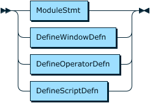

# Modules

Tremor-query supports nested namespaces or modules.

Modules in tremor are the lowest unit of compilation available to developers
to modularise tremor logic across multiple logical namespaces. On the filesystem,
modules are rooted at a base path and are nested with folders.

Within a file, nesting is via the `mod` clause.

> 

Modules can use trickle definitions via the `define` clause variants to define
windows, operators or scripts for reuse, or nested `mod` sub-modules.

> 

# Module Path

Modules can be defined physically on the file system. For example given the following modular hierarchy
on the file system, relative to a root module path: Nested modules can be defined as follows:

```text
  +-- foo
    +-- bar
      +-- snot.trickle
    +-- baz
      +-- badger.trickle
```

The same modular hierarchy can be defined as nested module declarations as follows:

```trickle
mod foo with
  mod bar with
    define tumbling window second with
      interval = 1000
    end;
  end;
  mod baz with
    define tumbling window minute with
      interval = 60000
    end;
  end;
end;

select event
from in[snot::second, badger::minute] # use our imported window definitions
into out;
```

Assuming this module hierarchy is rooted at `/opt/my-project/lib` they can be registered with tremor
by prepending this folder to the `TREMOR_PATH` environment variable

```bash
export TREMOR_PATH="/opt/my-project/lib:$TREMOR_PATH"
```

## Defaults

The `TREMOR_PATH` uses ':' on linux/unix to separate multiple module paths.

The default places to look for your modules is `/usr/local/share/tremor` if `TREMOR_PATH` is not provided.

The default place for the _tremor standard library_ is `/usr/share/tremor/lib`, so the full `TREMOR_PATH` default is

- `/usr/local/share/tremor`
- `/usr/share/tremor/lib`

## Referencing Modules with `use`

Modules can be loaded via the `use` clause which in turn loads a module from the physical file system via the module path:

```trickle
use foo::bar::snot; # snot is a ref to 'foo/bar/snot.trickle'
use foo::baz::badger; # badger is a ref to 'foo/bar/badger.trickle'

select event
from in[snot::second, badger::minute] # use our imported window definitions
into out;
```

Inline and externalized modules can be used separately or together as appropriate.

Where there are existing references a module can be aliased to avoid clashes in the local scope:

```trickle
use foo::bar as fleek;

select event
from in[fleek::second] # use our imported window definitions
into out;
```

It is to be noted that inclusion via use will prevent circular inclusion as in file `a.trickle` can use `b.trickle` but beyond
that point `b.trickle` can no longer use `a.trickle` as this would create a dependency cycle. This is a restriction of the
current implementation and may or may not be relaxed in the future.
