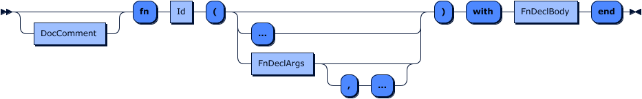
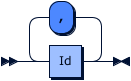
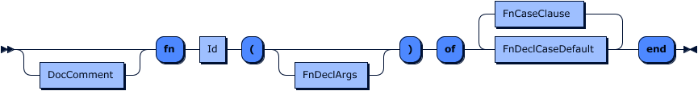

# Functions

Tremor-script provides access to a growing number of functions that allow
advanced data manipulation or access to additional information.

Functions are namespaced to make identification easier.

Tremor also supports user defined functions. There are a few
noteworthy restrictions:

1. Functions are pure / side effect free - you can not mutate `event`, `state`,
   or `$` inside of a function.
2. Functions have to return a value, as tremor-script is expression oriented.
3. Functions can only be defined once, even if they take different forms or
   arguments. Function overloading is not supported.
4. In matching functions, a `default` case is required.
5. Functions can call other functions but they have to be a priori defined. The order of definitions is significant.
6. Tail recursion is supported, and constrained to a maximum recursion depth. A recursion depth is imposed as tremor-script is designed to operate on infinite streams of data so indefinite blocking/recursion is not supportable by design.

Function Declaration Grammar:
> 

Lets look at the types of functions we have.

## Intrinsic Functions


Intrinsic functions represent builtin or pre-defined functions implemented in the rust programming
language that are a builtin component of the tremor project and are provided out of the box.

The function reference in this documentation set, for example, is generated from the documentation
provided in the standard library. The standard library is primarily composed of intrinsic or bulitin
functions.

## Standard functions






Standard functions are functions that take a given number of arguments, each with
a name. This function can be tail-recursive. An example would be:

```tremor
## This function adds two values together
fn add(a, b) with
  a + b
end
```

### Variable arguments

It is possible to use variable arguments by appending a final `...` ellipsis in a standard
function definition. The anonymous arguments will be provided via the `args` keyword.

### Recursion

Tail-recursion is provided for fixed arity ( number of arguments ) tandard functions.

Tremor imposes a restriction in recursion depth. As tremor is an event processing system
it is not desirable to have long running functions that block events from being processed
through the system.

```tremor
use std::array;

fn sum_(e, es) with
  let l = array::len(es);
  match l of
    case l when l > 0 => let a = es[0], recur(e + es[0], es[1:l])
    default => e
  end
end;

fn sum(...) with
  sum_(0, args)
end
```

## Match functions




Since matching and extracting are a core functionality for tremor matching on
function arguments is directly supported.

The same patterns that are used in `match` can be used in function cases
including extractors. If any extracting pattern is used and matches the function
argument will be replaced by the result of the extraction.

```tremor
## calculates the fibonaci sequence
fn fib_(a, b, n) of
  case (a, b, n) when n > 0 => recur(b, a + b, n - 1)
  default => a
end;

## calculates the fibonaci sequence
fn fib(n) with
  fib_(0, 1, n)
end;
```
