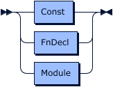

# Modules

Tremor-script supports nested namespaces or modules.

Modules in tremor are the lowest unit of compilation available to developers
to modularise tremor logic across multiple logical namespaces. On the filesystem,
modules are rooted at a base path and are nested with folders.
png)

Modules can define `const` constants, `fn` functions, or
nested `mod` sub-modules.

> 

# Module Path

Modules can be defined physically on the file system. For example given the following modular hierarchy
on the file system, relative to a root module path: Nested modules can be defined as follows:

```text
  +-- foo
    +-- bar
      +-- snot.tremor
    +-- baz
      +-- badger.tremor
```

Assuming this module hierarchy is rooted at `/opt/my-project/lib` they can be registered with tremor
by prepending this folder to the `TREMOR_PATH` environment variable

```bash
export TREMOR_PATH="/opt/my-project/lib:$TREMOR_PATH"
```

The `TREMOR_PATH` uses ':' on linux/unix to separate multiple module paths.

The default places to look for your modules is `/usr/local/share/tremor` if `TREMOR_PATH` is not provided.

The modules can be used using the `use` clause as follows:

```tremor
use foo::bar::snot; # snot is a ref to 'foo/bar/snot.tremor'
use foo::baz::badger; # badger is a ref to 'foo/bar/badger.tremor'

"#{snot::snot}#{badger::badger}"; # emits an interpolated string
```

The same modular hierarchy can be defined as nested module declarations as follows:

```tremor
mod foo with
  mod bar with
    const snot = "beep";
  end;
  mod baz with
    const badger = "boop";
  end;
end;

let snot = foo::bar::snot;
let badger = foo::baz::badger;

"#{snot}-#{badger}";
```

Modules can be loaded via the `use` clause which in turn loads a module from the physical file system via the module path.

Inline and externalized modules can be used separately or together as appropriate.

Where there are existing references a module can be aliased to avoid clashes in the local scope:

```tremor
use foo::bar as fleek;

"Hello #{fleek::snot}"
```

It is to be noted that inclusion via use will prevent circular inclusion as in file `a.tremor` can use `b.tremor` but beyond
that point `b.tremor` can no longer use `a.tremor` as this would create a dependency cycle. This is a restriction of the
current implementation and may or may not be relaxed in the future.
