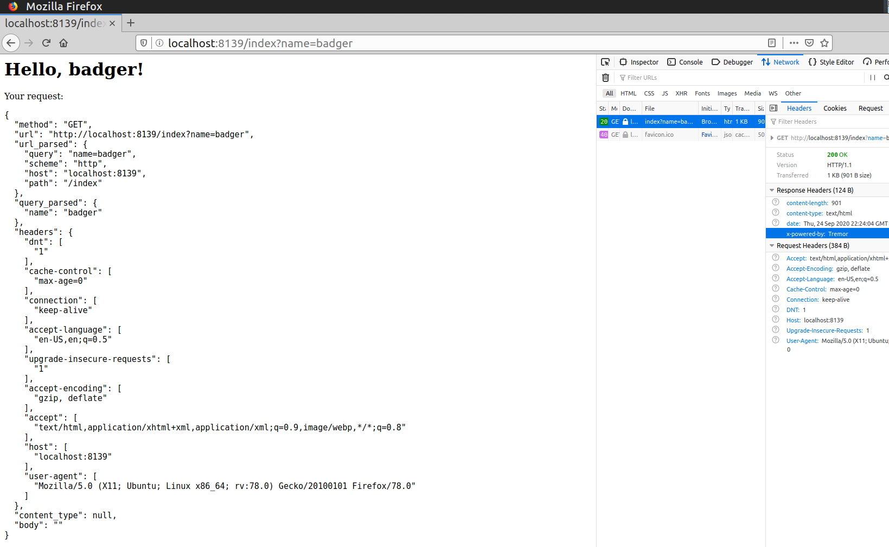

# HTTP Server

Example HTTP server application built on top of Tremor and meant to be a demonstration of [linked transports](../../../operations/linked-transports.md).

## Setup

!!! tip
    All the code here is available in the [git repository](https://github.com/tremor-rs/tremor-www-docs/tree/main/docs/workshop/examples/30_servers_lt_http) as well.

### Sources

We configure a rest onramp listening on port 8139:

```yaml
onramp:
  - id: http
    type: rest
    linked: true
    codec: string
    config:
      host: 0.0.0.0
      port: 8139
```

### Request flow

Incoming requests from clients are directed to the pipeline named [request_processing](etc/tremor/config/request_processing.trickle) pipeline, and the output of the pipeline is fed back again to the onramp -- this now becomes the server response to the incoming request.

```yaml
binding:
  - id: main
    links:
      "/onramp/http/{instance}/out":
        ["/pipeline/request_processing/{instance}/in"]

      # process incoming requests and send back the response
      "/pipeline/request_processing/{instance}/out":
        ["/onramp/http/{instance}/in"]
```

### Processing logic

In the `request_processing` pipeline, we are free to process the incoming request using tremor-script/tremor-query, and leveraging the various request and response metadata variables for the [rest onramp](../../../artefacts/onramps.md#rest). The event flow within the pipeline is captured below:

```trickle
create script process;

# main request processing
select event from in into process;
select event from process into out;

# our defined app errors (still succesful processing from tremor's perspective)
# useful to track these from different port (app_error) for metrics
select event from process/app_error into out;

# tremor runtime errors from the processing script
select event from process/err into err;
```

Example section of the `process` script here, demonstrating how the index page for the HTTP server is implemented (also parses the url query params to demonstrate dynamic responses based on provided user input):

```
    case "/index" =>
      let request_data = {
        "body": event,
        "meta": $request,
      },

      # determine the name to greet
      let name = match $request.url of
        case %{present query} =>
          let query_parsed = utils::parse_query($request.url.query),
          let request_data.url_query_parsed = query_parsed,
          match query_parsed of
            case %{present name} => query_parsed.name
            default => "world"
          end
        default => "world"
      end,

      # serve html!
      let $response.headers["content-type"] = "text/html",
      emit """
      <h1>Hello, #{name}!</h1>
      <p>Your request:</p>
      <pre>
        #{json::encode_pretty(request_data)}
      </pre>
      """
```

We don't include the whole pipeline logic here for brevity, but you can view it in full [here](etc/tremor/config/request_processing.trickle).

### Error handling

Of special interest is the binding specific for error handling -- we make sure to link the `err` ports from all the involved onramp/pipeline aretefacts and also ensure that the error events from those artefacts are bubbled up to the client appropriately, with proper HTTP status code (the latter is done via routing them all to the central [internal_error_processing](etc/tremor/config/internal_error_processing.trickle) pipeline).

```yaml
  - id: error
    links:
      "/onramp/http/{instance}/err":
        ["/pipeline/internal_error_processing/{instance}/in"]

      "/pipeline/request_processing/{instance}/err":
        ["/pipeline/internal_error_processing/{instance}/in"]

      # send back errors as response as well
      "/pipeline/internal_error_processing/{instance}/out":
        ["/onramp/http/{instance}/in"]

      # respond on errors during error processing too
      "/pipeline/internal_error_processing/{instance}/err":
        ["/onramp/http/{instance}/in"]
```

## Testing

Assuming you have all the code from the [git repository](https://github.com/tremor-rs/tremor-www-docs/tree/main/docs/workshop/examples/30_servers_lt_http), run the following to start our application:

```sh
docker-compose up
```

### Status checks

To verify that the server is up and running:

```sh
$ curl -v http://localhost:8139/snot
"badger"

# or a traditional ping path
$ curl -s -o /dev/null -w ""%{http_code} http://localhost:8139/ping
200
```

### HTML pages

If you navigate to [http://localhost:8139/](http://localhost:8139/) from your browser, you should be redirected to [http://localhost:8139/index](http://localhost:8139/index) first (part of the `request_processing` pipeline logic), and then you should be able to see all the request attributes that your browser sent to the server, pretty-printed.

Also try something like [http://localhost:8139/index?name=badger](http://localhost:8139/index?name=badger) -- we have a very simple dynamic web application now!

> 


### Request body decoding

The default codec for the onramp is `string` but if we set the `Content-Type` header at request time, the rest onramp uses it to decode the request body instead.

```sh
$ curl -v -XPOST -H'Content-Type:application/json' http://localhost:8139/echo -d'{"snot": "badger"}'
Note: Unnecessary use of -X or --request, POST is already inferred.
*   Trying 127.0.0.1:8139...
* TCP_NODELAY set
* Connected to localhost (127.0.0.1) port 8139 (#0)
> POST /echo HTTP/1.1
> Host: localhost:8139
> User-Agent: curl/7.65.3
> Accept: */*
> Content-Type:application/json
> Content-Length: 18
>
* upload completely sent off: 18 out of 18 bytes
* Mark bundle as not supporting multiuse
< HTTP/1.1 200 OK
< content-length: 265
< date: Thu, 15 Oct 2020 03:11:09 GMT
< content-type: application/json
< x-powered-by: Tremor
<
* Connection #0 to host localhost left intact
{"body":{"snot":"badger"},"meta":{"method":"POST","headers":{"content-length":["18"],"content-type":["application/json"],"accept":["*/*"],"host":["
localhost:8139"],"user-agent":["curl/7.65.3"]},"url":{"scheme":"http","host":"localhost","port":8139,"path":"/echo"}}}

# without the content-type header, `body` in the output would be an escaped json string here
$ curl -XPOST http://localhost:8139/echo -d'{"snot": "badger"}'
{"body":"{\"snot\": \"badger\"}","meta":{"method":"POST","headers":{"content-length":["18"],"content-type":["application/x-www-form-urlencoded"],"accept":["*/*"],"host":["localhost:8139"],"user-agent":["curl/7.65.3"]},"url":{"scheme":"http","host":"localhost","port":8139,"path":"/echo"}}}
```

### Stateful logic

To see the no of requests processed so far:

```sh
$ curl http://localhost:8139/stats
{"requests_processed":7}
```

This is utilizing the pipeline [state mechanism](../../../tremor-script/index.md#state) under the hood -- a simple yet powerful way to build stateful applications.

### Error handling

For the application-layer errors, the server allows for defining custom error responses and bubbling them up with proper HTTP status error code. Example with non-existent paths:

```sh
$ curl -i http://localhost:8139/non-existent-path
HTTP/1.1 404 Not Found
content-length: 57
date: Thu, 15 Oct 2020 03:00:05 GMT
content-type: application/json
x-powered-by: Tremor

{"error":"Path not found: /non-existent-path","event":""}
```

Internal tremor errors are also handled gracefully (via the [internal_error_processing](etc/tremor/config/internal_error_processing.trickle) pipeline):

```sh
# testing an endpoint that intentionally uses an undefined var: throws a runtime error
$ curl -i http://localhost:8139/error-test
HTTP/1.1 500 Internal Server Error
content-length: 202
date: Thu, 15 Oct 2020 03:06:09 GMT
content-type: application/json

{"error":"Oh no, we ran into something unexpected :(\n Error: \n   73 |       emit \"\"\n      |            ^^^^^^^^^^^^^^^^ Trying to access a non existing local key `non_existent_var`\n\n","event":""}

# similarly, for onramp-level error when invalid data is sent (non-json here when the request content-type header is set to be json)
$ curl -H'Content-Type:application/json' http://localhost:8139/echo -d'{'
{"error":"Oh no, we ran into something unexpected :(\n [Codec] Syntax at character 0 ('{')","event_id":6,"source_id":"tremor://localhost/onramp/http/01/in"}
```
