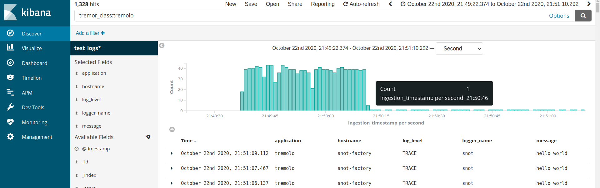

# Quota Service

Demo quota service, geared for a log collection usecase (but can be easily applied for similar needs elsewhere too).

This is a HTTP CRUD application running alongside an example log receiver setup (logs in via TCP -> tremor -> elastic out), that allows operators to easily (and quickly) update the throttling rates for various classes of logs. It also allows retrieving the current quotas for all classes, which can potentially be used by logging clients to pre-throttle on their end, even before transmitting the logs to tremor (or the information can be used to always provide up-to-date quota limits to folks using this log platform).

The application itself is written on top of tremor, utilizing the [linked transports](../../../operations/linked-transports.md) feature introduced in Tremor 0.9 and the [KV offramp](../../../artefacts/offramps.md#kv) introduced in Tremor 0.11.

## Setup

!!! note
    All the application code here is available from the docs [git repository](https://github.com/tremor-rs/tremor-www-docs/tree/main/docs/workshop/examples/36_quota_service).

```sh
# needed for elasticsearch container to start successfully
# https://www.elastic.co/guide/en/elasticsearch/reference/current/docker.html#_set_vm_max_map_count_to_at_least_262144
sudo sysctl -w vm.max_map_count=262144

# start everything (tremor/elasticsearch/kibana)
docker-compose up
```

Following services should now be accessible:

* Quota Service: (Tremor) [http://locahost:8139](http://localhost:8139)
* Log receiver (Tremor): tcp://localhost:12202
* Elasticsearch: [http://locahost:9200](http://localhost:9200)
* Kibana: [http://localhost:5601/](http://localhost:5601/)

## Log Ingestion

```sh
# send logs periodically to the tcp log receiver port (powered by tremor)
./logger.sh | nc localhost 12202
```

You should now see an elasticsearch index (`test_logs`) being created with the logs. Example:
```
$ curl localhost:9200/_cat/indices
yellow open test_logs xtdBODqGQ7Gub1PfUlcaWA 5 1 788 0  139kb  139kb
```

You can also inspect/visualize the logs from kibana. Create an index pattern [here](http://localhost:5601/app/kibana#/management/kibana/index) (eg: `test_logs*`), choosing `ingestion_timestamp` as the time field -- this allows timeseries navigation in the [Discover](http://localhost:5601/app/kibana#/discover) page as the logs are ingested (useful since we are replaying old log data dump).

## Using the Quota Service

**List routes**

```sh
$ curl http://localhost:8139

      Welcome to the Logging Quota Service!

      Available routes:

      GET /quotas
      GET /quotas/<quota_name>
      PUT /quotas/<quota_name>
      DELETE /quotas/<quota_name>

      HEAD /ping

      * /echo
```

**Get quotas**

```sh
# populated from file etc/tremor/data/quotas.json on startup
# output is keyed by class name (the details of the classification are defined in etc/tremor/config/logs.trickle)
$ curl -XGET localhost:8139/quotas

{"host_default":500,"logger_default":50,"index_default":100,"tremolo":100,"application_default":100}

# it is also possible to get single quotas
$ curl -XGET localhost:8139/quotas/index_default

{"index_default":100}
```

**Set quotas**

Changes to quotas are applied immediately, no scheduled reads of the quotas are necessary, no downtime to change configuration is required. What we get is updated quota handling in real-time:

```sh
# set rate for tremolo class of logs to 1 message per second
# returns the old, overwritten state on success
$ curl -XPUT -H'Content-Type: application/json' http://localhost:8139/quotas/tremolo" -d'1'

{"tremolo": 100}

# If you are monitoring the tremolo logs from kibana, you should now see the (debug) field `tremor_class_rate` change to 1 (from 100).
# More importantly, the log volume visible there should have also decreased.

# to remove the rate override for a given quota (i.e. switch to the default, hard-coded rate)
# curl -XDELETE http://localhost:8139/quotas/tremolo
```

Example kibana view demonstrating the change in number of tremolo logs, after setting the quota dynamically from the above api:
> 

**Debug request**

```sh
$ curl -XPOST localhost:8139/echo -d'{"snot": "badger"}'

{"body":"{\"snot\": \"badger\"}","meta":{"method":"POST","headers":{"content-length":["18"],"content-type":["application/x-www-form-urlencoded"],"user-agent":["curl/7.65.3"],"accept":["*/*"],"host":["localhost:8139"]},"url":{"scheme":"http","host":"localhost","port":8139,"path":"/echo"}}}
```
