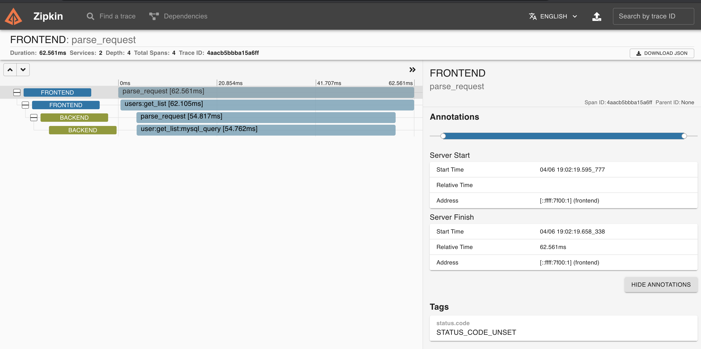

# CNCF OpenTelemetry Zipkin Interworking

This example builds on the simple passthrough CNCF OpenTelemetry
configuration but configures Zipkin as a receiver and exporter in the
OpenTelemetry Collector.

It shows how legacy observability frameworks such as Zipkin can be
ingested into OpenTelemetry based services directly, or via the
OpenTelemetry collector into tremor for specialized processing.

* Zipkin service
* CNCF OpenTelemetry Collector service
* CNCF OpenTelemetry Onramp deployed into tremor
* Deployment configuration file

External open telemetry clients can use port `4316` to send OpenTelemetry logs, traces and metrics
through tremor. Tremor prints the json mapping to standard out and forwards the events to the
OpenTelemetry collector.

## Environment

The [onramp](etc/tremor/config/00_ramps.yaml) we use is the `otel` CNCF OpenTelemetry onramp listening on a non-standard CNCF OpenTelemetry port `4316`, it receives protocol buffer messages over gRPC on this port. The log, metric and trace events received are converted to tremor's value system and passed through a passthrough pipeline to the CNCF OpenTelemetry sink. The sink will try to connect to a downstream CNCF
OpenTelemetry endpoint. In this workshop we will use the well known OpenTelemetry port of `4317` for our sink and run the standard OpenTelemetry collector on this port using its a simple [collector configuration](etc/otel/collector.yaml).

```yaml
onramp:
  - id: otlp
    type: otel # Use the OpenTelemetry gRPC listener source
    codec: json # Json is the only supported value
    config:
      port: 4316 # The TCP port to listen on
      host: "0.0.0.0" # The IP address to bind on ( all interfaces in this case )
```

It connects to a simple passthrough pipeline. This pipeline forwards any received
observability events downstream unchanged.

```trickle
select event from in into out;
```

We connect the passthrough output events into a standard output sink.
The [binding](./etc/tremor/config/01_binding.yaml) expresses these relations and gives deployment connectivity graph.

```yaml
binding:
  - id: example
    links:
      '/onramp/otlp/{instance}/out':
       - '/pipeline/example/{instance}/in'
      '/pipeline/example/{instance}/out':
       - '/offramp/stdout/{instance}/in'
```

Finally the [mapping](./etc/tremor/config/02_mapping.yaml) instanciates the binding with the given name and instance variable to activate the elements of the binding.

```yaml
mapping:
  /binding/example/passthrough:
    instance: "passthrough"
```

## Business Logic

```trickle
select event from in into out
```

## Command line testing during logic development

Use any compliant OpenTelemetry instrumented application and configure the
server to our source on port `4316` instead of the default `4317`.

## Docker

For convenience, use the provided [docker-compose.yaml](./docker-compose.yaml) to
start and stop tremor and the opentelemetry collector as follows:

```bash
# Start
$ docker compose up

# Stop
$ docker compose down
```

## Zipkin client

We use an existing Zipkin client for demonstration purposes. Fetch the standard zipkin php
client as follows:

```bash
# Clone the git repo
$ git clone https://github.com/openzipkin/zipkin-php-example
# Cd into the repo root
$ cd zipkin-php-example
# Install dependent php libraries
$ composer install
```

And, assuming you have PHP composer, run the front and backend in two separate terminal windows:

```bash
# Spin up the PHP backend on `locahost:9000`
composer -run run-frontend
```

```bash
# Spin up the PHP frontend on `localhost:8081`
composer -run run-backend
```

Hit the frontend via curl ( in another terminal )

```bash
# Generate trace spand via curl
curl -o - http://locahost:8081/
```

Verify that our frontend has issued some spans in its terminal output

```bash
# Output from our frontend composer terminal
> php -S 'localhost:8081' frontend.php
[Tue Apr  6 18:53:56 2021] PHP 7.4.10 Development Server (http://localhost:8081) started
[Tue Apr  6 18:54:03 2021] [::1]:50812 Accepted
[Tue Apr  6 18:54:03 2021] [::1]:50812 Closing
```

Verify that our PHP backend has issued some spans in its terminal output

```bash
# Output from our backend composer terminal
> php -S 'localhost:9000' backend.php
[Tue Apr  6 18:50:34 2021] PHP 7.4.10 Development Server (http://localhost:9000) started
[Tue Apr  6 18:54:03 2021] [::1]:50813 Accepted
[Tue Apr  6 18:54:03 2021] [::1]:50813 Closing
```

Verify our spans reached the Zipkin UI deployed in docker via pointing our browser to `http://localhost:9412` by searching for traces:



Note that we expose the Zipkin UI on a non-standard port via docker so that our Zipkin traffic actually gets routed via the `opentelemetry collector` to `tremor` and to the Zipkin service and ui. In this way the `opentelemetry collector` and `tremor`.

From the perspective of the Zipkin PHP client - this is a plain vanilla Zipkin service.
In practice, this is the `opentelemetry-collector` which is forwarding to both tremor and to the zipkin-ui in this demo.

## Advanced

Rather than run multiple sidecars, tremor could be configured to transform Zipkin
traffic directly to the OpenTelemetry format. Given transformation logic as follows

```tremor
### Transform zipkin b3 ( http/json ) to otel

use cncf::otel;
use tremor::system;
use std::record;

fn transform_span(span) with

  # A simple transient event counter
  let count = match state of
    case null => let state = 0
    default => let state = state + 1
  end;

  match span of
    case %{
      present id,           # span id
      # present parentId,   # span parent id
      present traceId,      # trace id
      present annotations,
      present name,         # name
      #present kind,        # CLIENT
      # present remoteEndpoint,
      present timestamp,
      present tags,
      present duration,
      present localEndpoint,
    } =>
        {
          "resource": {
            "attributes": merge span.tags of
               { "tremor.ingest_ns": system::ingest_ns() }
             end,
            "dropped_attributes_count": 0,
          },
          "instrumentation_library_spans": [
            {
              "instrumentation_library": {
                "name": "tremor",
                "version": system::version(),
              },
              "spans": [
                {
                  "start_time_unix_nano": (span.timestamp * 1000),
                  "end_time_unix_nano": (span.timestamp * 1000) + (span.duration * 1000),
                  "name": "#{span.name} - #{count}",
                  "attributes": record::from_array(for span.annotations of
                    case(i,e) => [ "zipkin.annotation.#{e.value}", e.timestamp * 1000  ] # convert ts micros -> nanos
                  end),
                  "dropped_attributes_count": 0,
                  "kind": match span of
                     case %{ present kind } =>
                       match span.kind of
                        case "CLIENT" => otel::trace::spankind::client
                        case "SERVER" => otel::trace::spankind::server
                        case "PRODUCER" => otel::trace::spankind::server
                        case "CONSUMER" => otel::trace::spankind::server
                        default => otel::trace::spankind::client
                      end
                     default => otel::trace::spankind::client
                  end,
                  "trace_state": "",
                  "parent_span_id": match span of
                    case %{ present parentId, } => span.parentId
                    default => "" # no parent span
                  end,
                  "span_id": span.id,
                  "trace_id": span.traceId,
                  "status": otel::trace::status::ok(),
                  "events": [],
                  "links": [],
                  "dropped_events_count": 0,
                  "dropped_links_count": 0,
                }
              ]
            }
          ]
        }
    default => { "drop": span }
  end
end;
```

And a simple tremor query as follows:

```trickle
#
# Process zipkin b3 [span] to [otel resource span]
#
define script to_zipkin
script
  use zipkin_to_otel;
  for event.trace of
    case (i,span) =>
      merge zipkin_to_otel::transform_span(span) of
        {
          "resource": {
            "attributes": {
              "http.url.path": event.request.url.path,
              "http.url.host": event.request.url.host,
              "http.url.port": event.request.url.port,
              "http.url.scheme": event.request.url.scheme,
              "http.headers.user-agent": event.request.headers.user-agent[0],
              "http.headers.b3": event.request.headers.b3[0],
              "http.method": event.request.method,
            }
          }
        }
      end
  end
end;
create script to_zipkin;

# Push zipkin-b3/http [trace] into transformer capturing http request metadata
select { "request": $request, "trace": event } from in into to_zipkin;

# Wrap resource spans as a trace event compatible with tremor otel sink
select { "trace": event } from to_zipkin into out;
```

Removing the `zipkin-all-in-one` container from this walkthrough's `docker-compose.yaml` and removing the `OpenTelemetry collector` configuration and container should be sufficient to produce a basic working environment based solely on tremor, and the
Zipkin PHP clients with minor adjustments to the script and query files above.

However, the CNCF OpenTelemetry Collector has excellent support for legacy observability
frameworks and formats. Tremor does not. The Zipkin UI will be familiar to users who
have experience of observability through the Zipkin project. Tremor does not have a UI at all. We provide the example to illustrate a more complete example of how tremor is typically configured in production environments and to illustrate how existing trace and span information can relatively easily be adapted to `CNCF OpenTelemetry` using tremor's scripting and query language support.
