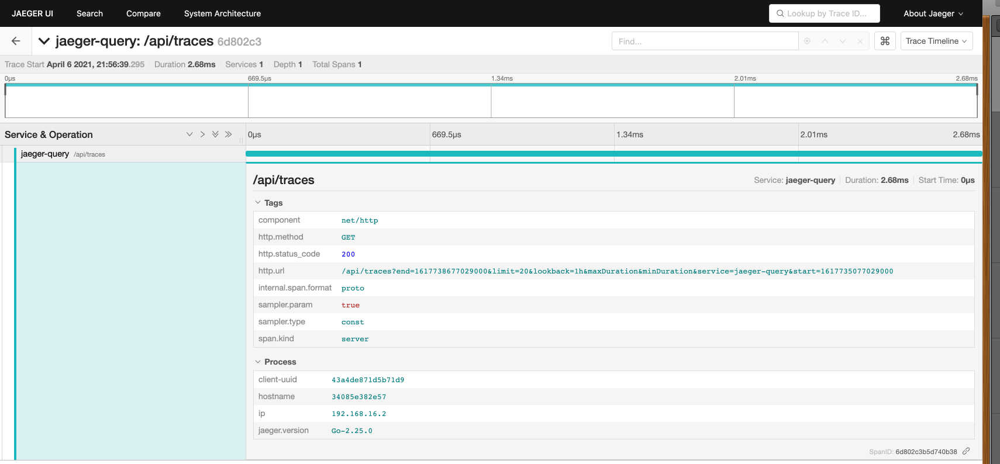
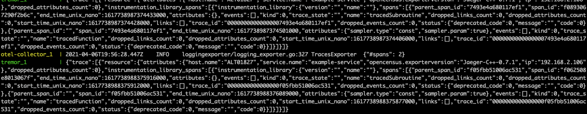

# CNCF OpenTelemetry Jaeger Interworking

!! note
    All the application code here is available from the docs [git repository](https://github.com/tremor-rs/tremor-www-docs/tree/main/docs/workshop/examples/42_otel_jaeger).

This example builds on the simple passthrough CNCF OpenTelemetry
configuration but configures Jaeger as a receiver and exporter in the
OpenTelemetry Collector.

It shows how legacy observability frameworks such as Jaeger can be
ingested into OpenTelemetry based services directly, or via the
OpenTelemetry collector into tremor for specialized processing.

* Jaeger service
* CNCF OpenTelemetry Collector service
* CNCF OpenTelemetry Onramp deployed into tremor
* Deployment configuration file

External OpenTelemetry clients can use port `4316` to send OpenTelemetry logs, traces and metrics
through tremor. Tremor prints the json mapping to standard out and forwards the events to the
OpenTelemetry collector.

## Environment

The [onramp](etc/tremor/config/00_ramps.yaml) we use is the `otel` CNCF OpenTelemetry onramp listening on a non-standard CNCF OpenTelemetry port `4316`, it receives protocol buffer messages over gRPC on this port. The log, metric and trace events received are converted to tremor's value system and passed through a passthrough pipeline to the CNCF OpenTelemetry sink. The sink will try to connect to a downstream CNCF
OpenTelemetry endpoint. In this workshop we will use the well known OpenTelemetry port of `4317` for our sink and run the standard OpenTelemetry collector on this port using its a simple [collector configuration](etc/otel/collector.yaml).

```yaml
onramp:
  - id: otlp
    type: otel # Use the OpenTelemetry gRPC listener source
    codec: json # Json is the only supported value
    config:
      port: 4316 # The TCP port to listen on
      host: "0.0.0.0" # The IP address to bind on ( all interfaces in this case )
```

It connects to a simple passthrough pipeline. This pipeline forwards any received
observability events downstream unchanged.

We connect the passthrough output events into a standard output sink.
The [binding](./etc/tremor/config/01_binding.yaml) expresses these relations and gives deployment connectivity graph.

```yaml
binding:
  - id: example
    links:
      '/onramp/otlp/{instance}/out':
       - '/pipeline/example/{instance}/in'
      '/pipeline/example/{instance}/out':
       - '/offramp/stdout/{instance}/in'
```

Finally the [mapping](./etc/tremor/config/02_mapping.yaml) instanciates the binding with the given name and instance variable to activate the elements of the binding.

```yaml
mapping:
  /binding/example/passthrough:
    instance: "passthrough"
```

## Business Logic

```trickle
select event from in into out
```

## Command line testing during logic development

Use any compliant OpenTelemetry instrumented application and configure the
server to our source on port `4316` instead of the default `4317`.

## Docker

For convenience, use the provided [docker-compose.yaml](./docker-compose.yaml) to
start and stop tremor and the OpenTelemetry collector as follows:

```bash
# Start
$ docker compose up

# Stop
$ docker compose down
```

## Jaeger client

We use an existing Jaeger client for demonstration purposes. Fetch the standard C++ Jaeger
client as follows:

```bash
# Clone the git repo
$ git clone https://github.com/jaegertracing/jaeger-client-cpp
# Change directory into the repo root
$ cd jaeger-client-cpp
# Build ( make a cup of tea, this takes a while! )
$ mkdir build
$ cd build
$ cmake ..
$ make
```

Configure the example jaeger application to point at our dockerized service

```yaml
disabled: false
reporter:
  logSpans: true
  endpoint: http://localhost:14268/api/traces
sampler:
  type: const
  param: 1
```

Run the jeager client to generate trace spans

```bash
# From the `build` directory
$ ./app ../examples/config.yml
INFO: Initializing logging reporter
INFO: Reporting span f05fbb51006ac531:f062508e8013067f:f05fbb51006ac531:1
INFO: Reporting span f05fbb51006ac531:f05fbb51006ac531:0000000000000000:1
```

Verify our spans reached the Jaeger UI deployed in docker via pointing our browser to `http://localhost:16686` by searching for traces:



Verify that the OpenTelemetry Collector and tremor have processed our trace spans.
In this configuration we use the OpenTelemetry Collector to forward to Jaeger and to
forward to tremor.


