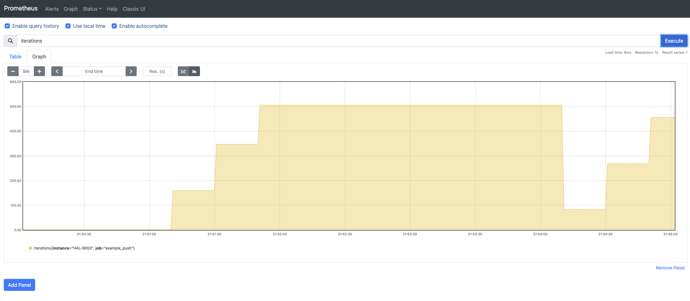
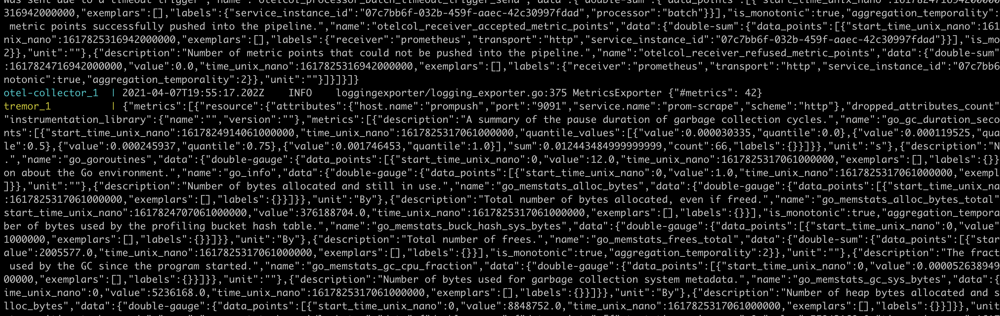

# CNCF OpenTelemetry Prometheus Interworking

!! note
    All the application code here is available from the docs [git repository](https://github.com/tremor-rs/tremor-www-docs/tree/main/docs/workshop/examples/43_otel_prometheus).

This example builds on the simple passthrough CNCF OpenTelemetry
configuration but configures Prometheus as a receiver and exporter in the
OpenTelemetry Collector.

It shows how legacy observability frameworks such as Prometheus can be
ingested into OpenTelemetry based services directly, or via the
OpenTelemetry collector into tremor for specialized processing.

* Prometheus service and the Prometheus Push Gateway
* CNCF OpenTelemetry Collector service
* CNCF OpenTelemetry Onramp deployed into tremor
* Deployment configuration file

External OpenTelemetry clients can use port `4316` to send OpenTelemetry logs, traces and metrics
through tremor. Tremor prints the json mapping to standard out and forwards the events to the
OpenTelemetry collector.

## Environment

The [onramp](etc/tremor/config/00_ramps.yaml) we use is the `otel` CNCF OpenTelemetry onramp listening on a non-standard CNCF OpenTelemetry port `4316`, it receives protocol buffer messages over gRPC on this port. The log, metric and trace events received are converted to tremor's value system and passed through a passthrough pipeline to the CNCF OpenTelemetry sink. The sink will try to connect to a downstream CNCF OpenTelemetry endpoint. In this workshop we will use the well known OpenTelemetry port of `4317` for our sink and run the standard OpenTelemetry collector on this port using its a simple [collector configuration](etc/otel/collector.yaml).

```yaml
onramp:
  - id: otlp
    type: otel # Use the OpenTelemetry gRPC listener source
    codec: json # Json is the only supported value
    config:
      port: 4316 # The TCP port to listen on
      host: "0.0.0.0" # The IP address to bind on ( all interfaces in this case )
```

It connects to a simple passthrough pipeline. This pipeline forwards any received
observability events downstream unchanged.

We connect the passthrough output events into a standard output sink.
The [binding](./etc/tremor/config/01_binding.yaml) expresses these relations and gives deployment connectivity graph.

```yaml
binding:
  - id: example
    links:
      '/onramp/otlp/{instance}/out':
       - '/pipeline/example/{instance}/in'
      '/pipeline/example/{instance}/out':
       - '/offramp/stdout/{instance}/in'
```

Finally the [mapping](./etc/tremor/config/02_mapping.yaml) instanciates the binding with the given name and instance variable to activate the elements of the binding.

```yaml
mapping:
  /binding/example/passthrough:
    instance: "passthrough"
```

## Business Logic

```trickle
select event from in into out
```

## Command line testing during logic development

Use any compliant OpenTelemetry instrumented application and configure the
server to our source on port `4316` instead of the default `4317`.

## Docker

For convenience, use the provided [docker-compose.yaml](./docker-compose.yaml) to
start and stop tremor and the OpenTelemetry collector as follows:

```bash
# Start
$ docker compose up

# Stop
$ docker compose down
```

## Prometheus client

We provide a simple prometheus client implemented in rust

```rust
use device_query::{DeviceState, Keycode};
use prometheus::{labels, register_counter};
use std::{error::Error, thread, time};

fn main() -> Result<(), Box<dyn Error>> {
    let ten_ms = time::Duration::from_millis(100);
    let johnny_five = DeviceState::new();
    let counter = register_counter!("iterations", "Number of badgers in snot green situations")?;
    let mut done = false;

    thread::sleep(time::Duration::from_secs(1)); // Delay at start in case user still has keys pressed
    println!("Press any key to stop ...");

    'main: loop {
        if done {
            println!("Done");
            break;
        }

        // Terminate if any input on stdin
        let keymap = johnny_five.query_keymap();
        for keycode in keymap {
            match keycode {
                Keycode::Right | Keycode::Left | Keycode::Up | Keycode::Down => (),
                _any_other_key => {
                    done = true;
                    continue 'main;
                }
            }
        }

        let metric_families = prometheus::gather();
        println!("Sending metrics: {}", counter.get());

        prometheus::push_metrics(
            "example_push",
            labels! {"instance".to_owned() => "HAL-9000".to_owned(),},
            "0.0.0.0:9091", // This refers to our prometheus push gateway in the docker-compose
            metric_families,
            None, // No authentication
        )?;
        counter.inc();

        thread::sleep(ten_ms);
    }

    Ok(())
}
```

Build and run the rust prometheus client:

```bash
$ cd prometheus-rust-client
$ cargo build
$ cargo run
```

Hit any non-cursor key to stop the client from injecting spans ( 10 per second ).

Verify our metrics reached the Prometheus UI deployed in docker via pointing our browser to `http://localhost:9090` by searching for metrics:



Verify that the OpenTelemetry Collector and tremor have processed our trace spans.
In this configuration we use the OpenTelemetry Collector to forward to Prometheus and to
forward to tremor.


