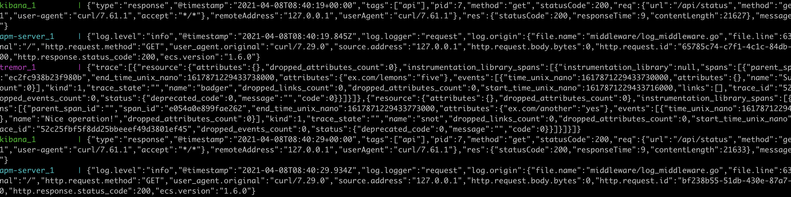
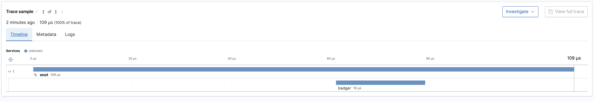

# CNCF OpenTelemetry Elastic APM Interworking

!!! note
    All the application code here is available from the docs [git repository](https://github.com/tremor-rs/tremor-www-docs/tree/main/docs/workshop/examples/44_otel_elastic_apm).

This example builds on the simple passthrough CNCF OpenTelemetry
configuration but configures Elastic APM as an exporter in the
OpenTelemetry Collector.

It shows how Elastic APM can be used with OpenTelemetry based services directly, or via
tremor for specialized processing.

* The Elastic Suite including search, Kibana and the APM server
* CNCF OpenTelemetry Onramp and Offramp deployed into tremor
* Deployment configuration file

External OpenTelemetry clients can use port `4316` to send OpenTelemetry logs, traces and metrics
through tremor. Tremor prints the json mapping to standard out and forwards the events to the
OpenTelemetry collector downstream - which is an instance of the Elastic APM Server in this case.

## Environment

The [onramp](etc/tremor/config/00_ramps.yaml) we use is the `otel` CNCF OpenTelemetry onramp listening on a non-standard CNCF OpenTelemetry port `4316`, it receives protocol buffer messages over gRPC on this port. The log, metric and trace events received are converted to tremor's value system and passed through a passthrough pipeline to the CNCF OpenTelemetry sink. The sink will try to connect to a downstream CNCF OpenTelemetry endpoint. In this workshop we will use the well known OpenTelemetry port of `4317` for our sink and run the standard OpenTelemetry collector on this port using its a simple [collector configuration](etc/otel/collector.yaml).

```yaml
onramp:
  - id: otlp
    type: otel # Use the OpenTelemetry gRPC listener source
    codec: json # Json is the only supported value
    config:
      port: 4316 # The TCP port to listen on
      host: "0.0.0.0" # The IP address to bind on ( all interfaces in this case )
```

```yaml
offramp:
  - id: otlp
    type: otel # Use the OpenTelemetry gRPC client
    codec: json # Json is the only supported value
    config:
      port: 8200 # The TCP port to distributed to
      host: "apm-server" # The Elastic APM server we're distributing to
```

It connects to a simple passthrough pipeline. This pipeline forwards any received
observability events downstream unchanged.

We connect the passthrough output events into a standard output sink.
The [binding](./etc/tremor/config/01_binding.yaml) expresses these relations and gives deployment connectivity graph.

```yaml
binding:
  - id: example
    links:
      '/onramp/otlp/{instance}/out':
       - '/pipeline/example/{instance}/in'
      '/pipeline/example/{instance}/out':
       - '/offramp/stdout/{instance}/in'
       - '/offramp/otlp/{instance}/in'
```

Finally the [mapping](./etc/tremor/config/02_mapping.yaml) instanciates the binding with the given name and instance variable to activate the elements of the binding.

```yaml
mapping:
  /binding/example/passthrough:
    instance: "passthrough"
```

## Business Logic

```trickle
select event from in into out
```

## Command line testing during logic development

Use any compliant OpenTelemetry instrumented application and configure the
server to our source on port `4316` instead of the default `4317`.

## Docker

For convenience, use the provided [docker-compose.yaml](./docker-compose.yaml) to
start and stop tremor and the OpenTelemetry collector as follows:

```bash
# Start
$ docker-compose up

# Stop
$ docker-compose down
```

## Post-installation steps

Once the environment is running we can log into [kibana](http://localhost:5601) and
select the [APM](http://localhost:5601/app/apm/services?rangeFrom=now-15m&rangeTo=now) service
from the menu system.

Using any OpenTelemetry client, send metrics or traces ( not logs as Elastic APM does not support
log shipping yet ) to tremor on its OpenTelemetry port. We should see them log to console.

Console output from docker:



We should also be able to see metrics and spans in the APM service section of elastic.



## Advanced

It should be relatively simple to configure the ElasticSearch offramp in tremor for log shipping to elastic whilst exposing a pure OpenTelemetry interface to the outside world.

This would allow upstream clients to use the OpenTelemetry protocol exclusively. A simple tremor algorithm can batch and convert OpenTelemetry log formatted messages to the form that the ElasticSearch APIs prefer for bulk log shipping.